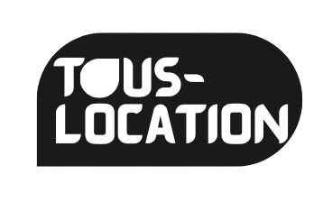
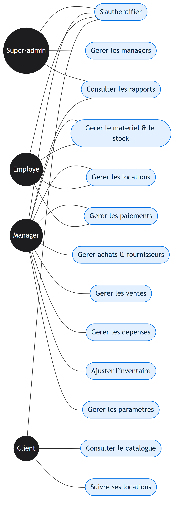
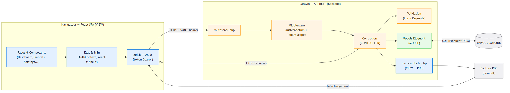
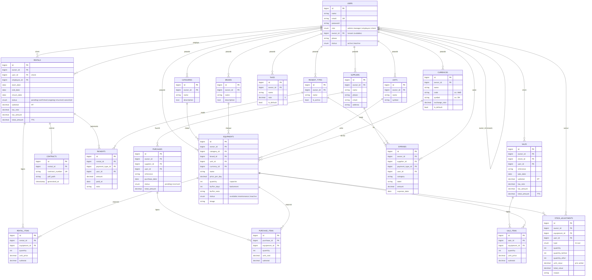
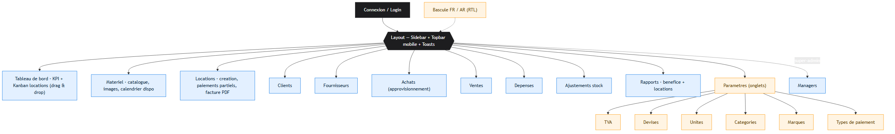

---
pdf_options:
  format: A4
  margin: 20mm
  printBackground: true
css: |
  body { font-family: "Times New Roman", Georgia, serif; color: #1a1a1a; line-height: 1.6; font-size: 13px; text-align: justify; }
  h1 { font-size: 22px; }
  h2 { font-size: 17px; border-bottom: 2px solid #0071e3; padding-bottom: 4px; margin-top: 26px; color: #0a2540; }
  h3 { font-size: 14px; margin-top: 16px; color: #1a3a5c; }
  h4 { font-size: 13px; margin: 12px 0 2px; color: #0a2540; }
  a { color: #0071e3; text-decoration: none; }
  img { max-width: 100%; display: block; margin: 10px auto; }
  .cap { text-align: center; font-size: 11px; color: #555; font-style: italic; margin: 4px 0 14px; }
  table { border-collapse: collapse; width: 100%; font-size: 11.5px; margin: 10px 0; }
  th, td { border: 1px solid #c9c9c9; padding: 6px 9px; text-align: left; vertical-align: top; }
  th { background: #eef4fb; }
  ul, ol { margin: 6px 0 6px 18px; }
  blockquote { border-left: 3px solid #0071e3; margin: 10px 0; padding: 4px 12px; color: #444; background: #f7faff; }
  .page-break { page-break-after: always; }
  .center { text-align: center; }
  .cover { text-align: center; }
  .cover h1 { font-size: 28px; margin: 10px 0 2px; color: #0a2540; }
  .cover .sub { font-size: 16px; color: #444; }
  .cover img { width: 150px; margin: 18px auto; }
  .cover .school { font-size: 15px; font-weight: bold; letter-spacing: .5px; }
  .cover .infos { margin-top: 36px; font-size: 14px; line-height: 2; text-align: left; display: inline-block; }
  .cover .yr { margin-top: 36px; font-size: 14px; font-weight: bold; }
  .quote-ded { font-style: italic; text-align: center; line-height: 2; font-size: 14px; }
  .view { background: #f7faff; border: 1px solid #e1ecfb; border-radius: 8px; padding: 8px 12px; margin: 8px 0; }
---

OFFICE DE LA FORMATION PROFESSIONNELLE ET DE LA PROMOTION DU TRAVAIL OFPPT – ISAG — CASABLANCA

Filière : Développement Digital

RAPPORT DE PROJET DE FIN D'ÉTUDES

# Conception et réalisation d'une application web de gestion de location de matériel — « TousLocation »

<strong>Réalisé par&nbsp;:</strong> &nbsp;Youssef ELWAFI 
<strong>Encadré par&nbsp;:</strong> &nbsp;M. Othmane DAIF 
<strong>Filière&nbsp;:</strong> &nbsp;Développement Digital 
<strong>Établissement&nbsp;:</strong> &nbsp;OFPPT – ISAG, Casablanca

Année de formation : 2025 / 2026

## Dédicace

Je dédie ce modeste travail&nbsp;:  
À mes chers <strong>parents</strong>, pour leur amour, leurs sacrifices et leur soutien
constant&nbsp;;  
À toute ma <strong>famille</strong> et à mes <strong>amis</strong>, pour leurs
encouragements&nbsp;;  
À mes <strong>formateurs</strong> de l'OFPPT, pour le savoir transmis&nbsp;;  
À toutes celles et ceux qui ont contribué, de près ou de loin, à la réussite de ce
projet.

## Remerciements

Au terme de ce projet de fin d'études, je tiens à exprimer ma profonde reconnaissance à
toutes les personnes qui ont contribué à son aboutissement.

Je remercie tout particulièrement mon encadrant, **M. Othmane DAIF**, pour son
encadrement, sa disponibilité et ses précieux conseils tout au long de ce travail.

Mes remerciements s'adressent également à l'ensemble du **corps formateur et
administratif de l'OFPPT – ISAG de Casablanca**, pour la qualité de la formation reçue.

Enfin, je remercie ma **famille** et mes **amis** pour leur soutien moral indéfectible.

## Résumé

Ce projet de fin d'études porte sur la **conception et la réalisation de TousLocation**,
une application web de **gestion de location de matériel** destinée aux entreprises
marocaines. L'objectif est de remplacer les méthodes manuelles (papier, Excel) par une
solution centralisée, fiable et complète.

L'application repose sur une architecture découplée : une **API REST Laravel** (PHP), une
interface **React** (Single Page Application) et une base de données **MySQL/MariaDB**.
Elle couvre tout le cycle d'exploitation : catalogue et stock, locations (disponibilité,
TVA, paiements partiels, facture PDF), achats, ventes, dépenses, ajustements de stock et
**reporting financier**. Le système est **multi-entreprises (multi-tenant)**,
**sécurisé**, **responsive** et **bilingue français/arabe**.

**Mots-clés :** location de matériel, Laravel, React, API REST, base de données,
multi-tenant, gestion de stock, développement web.

### Abstract

This end-of-studies project deals with the **design and development of TousLocation**, an
**equipment-rental management** web application for Moroccan businesses. It replaces
manual methods with a centralized, reliable and complete solution. Built on a **Laravel
REST API**, a **React** SPA and a **MySQL/MariaDB** database, it covers the whole
operational cycle: catalogue and stock, rentals (availability, VAT, partial payments, PDF
invoice), purchasing, sales, expenses, stock adjustments and **financial reporting**. The
system is **multi-tenant**, **secure**, **responsive** and **bilingual (French/Arabic)**.

**Keywords:** equipment rental, Laravel, React, REST API, database, multi-tenant, stock
management, web development.

## Table des matières

- **Introduction générale**
- **Chapitre 1 — Contexte général du projet**
  - 1.1 Présentation du projet
  - 1.2 Problématique
  - 1.3 Étude de l'existant
  - 1.4 Objectifs du projet
  - 1.5 Solution proposée
  - 1.6 Méthodologie de conduite du projet
- **Chapitre 2 — Analyse et conception**
  - 2.1 Spécification des besoins
  - 2.2 Acteurs du système
  - 2.3 Diagramme de cas d'utilisation
  - 2.4 Architecture de l'application (MVC)
  - 2.5 Conception de la base de données
- **Chapitre 3 — Réalisation**
  - 3.1 Environnement et outils de développement
  - 3.2 Technologies utilisées
  - 3.3 Structure des vues : étapes et fonctionnalités
  - 3.4 Sécurité et isolation multi-tenant
  - 3.5 Tests et déploiement
  - 3.6 Difficultés rencontrées et solutions
- **Conclusion générale et perspectives**
- **Références**
- **Annexes**

### Liste des figures

| N° | Figure |
| -- | ------ |
| Figure 1 | Diagramme de cas d'utilisation |
| Figure 2 | Architecture technique (MVC) |
| Figure 3 | Schéma de la base de données (modèle E-A) |
| Figure 4 | Arborescence des vues de l'interface |

### Liste des tableaux

| N° | Tableau |
| -- | ------- |
| Tableau 1 | Besoins fonctionnels |
| Tableau 2 | Outils et technologies utilisés |
| Tableau 3 | Comptes de démonstration |

## Introduction générale

La transformation digitale s'impose aujourd'hui comme un facteur clé de compétitivité
pour les entreprises. De nombreuses activités, encore gérées manuellement, gagneraient à
être informatisées afin d'améliorer la fiabilité, la traçabilité et la productivité. Le
secteur de la **location de matériel** (informatique, audiovisuel, événementiel,
chantier) illustre parfaitement ce besoin : suivi difficile des disponibilités, risques
de double réservation, lenteur de facturation et absence de vision financière globale.

C'est dans ce cadre que s'inscrit ce **projet de fin d'études** : la conception et la
réalisation de **TousLocation**, une application web complète de gestion de location de
matériel.

Ce rapport s'articule autour de **trois chapitres** : le premier présente le **contexte
général** du projet (problématique, objectifs, solution) ; le deuxième traite de
l'**analyse et de la conception** (besoins, cas d'utilisation, architecture, base de
données) ; le troisième décrit la **réalisation** (outils, technologies, structure des
vues, sécurité, tests et déploiement). Une conclusion générale dresse le bilan et les
perspectives.

## Chapitre 1 — Contexte général du projet

### Introduction du chapitre

Ce chapitre situe le projet dans son contexte : il en présente la problématique,
analyse l'existant, fixe les objectifs et expose la solution retenue ainsi que la
méthodologie suivie.

### 1.1 Présentation du projet

**TousLocation** est une application web destinée aux entreprises de location de
matériel. Elle vise à centraliser et automatiser l'ensemble des opérations : gestion du
matériel et du stock, locations, facturation, achats, ventes, dépenses et suivi
financier, le tout au sein d'une interface moderne et accessible.

### 1.2 Problématique

La gestion traditionnelle de la location de matériel présente plusieurs limites :

- difficulté de suivi des locations en cours et de la **disponibilité réelle** ;
- risque élevé d'**erreurs** et de **double réservation** ;
- **lenteur** dans l'établissement des contrats et des factures ;
- absence de **vision financière consolidée** (revenus, coûts, bénéfice) ;
- **faible sécurité** et aucune séparation des données entre entités.

### 1.3 Étude de l'existant

Les solutions actuellement utilisées par de nombreuses petites structures reposent sur
le **papier** ou des **fichiers Excel**. Ces approches sont peu fiables (erreurs de
saisie), non collaboratives, sans contrôle automatique de disponibilité ni reporting.
Les logiciels du marché, quant à eux, sont souvent **coûteux**, **généralistes** et peu
adaptés au contexte marocain (Dirham, TVA, bilinguisme). Ce constat justifie le
développement d'une solution **sur mesure**, simple et complète.

### 1.4 Objectifs du projet

- Gérer le **catalogue de matériel** (images, disponibilité, calendrier).
- Gérer le **cycle de location** (réservation, paiements partiels, retour, facture PDF).
- Gérer l'**approvisionnement** (achats), les **ventes**, les **dépenses** et les
  **ajustements de stock**.
- Fournir des **rapports** (bénéfice, locations).
- Garantir l'**isolation des données** entre entreprises (multi-tenant).
- Offrir une interface **moderne, responsive et bilingue** (français / arabe).

### 1.5 Solution proposée

La solution proposée est une **application web** à architecture **découplée** :

- un **back-end** Laravel exposant une **API REST** sécurisée ;
- un **front-end** React (Single Page Application) consommant l'API ;
- une base de données **MySQL/MariaDB**.

Cette architecture assure une bonne séparation des responsabilités, une maintenance
facilitée et une évolutivité (ajout de modules, application mobile future).

### 1.6 Méthodologie de conduite du projet

Le projet a été mené selon une **démarche itérative et incrémentale** : analyse du
besoin, conception, développement par modules, tests, puis déploiement. Chaque module a
été développé et validé avant de passer au suivant, ce qui a permis de livrer une
application stable et cohérente.

### Conclusion du chapitre

Après avoir défini le contexte, la problématique et la solution, le chapitre suivant
détaille l'analyse des besoins et la conception du système.

## Chapitre 2 — Analyse et conception

### Introduction du chapitre

Ce chapitre présente l'analyse des besoins, les acteurs du système, le diagramme de cas
d'utilisation, l'architecture logicielle et la conception de la base de données.

### 2.1 Spécification des besoins

**Tableau 1 — Besoins fonctionnels**

| Module | Besoin |
| ------ | ------ |
| Authentification | Connexion sécurisée, gestion des rôles |
| Matériel | CRUD, images, catégories/marques/unités, calendrier de disponibilité |
| Locations | Réservation multi-articles, TVA, paiements partiels, facture PDF |
| Achats | Fournisseurs, commandes alimentant le stock |
| Ventes | Vente de matériel, décrément du stock |
| Dépenses | Saisie des charges par catégorie |
| Ajustements | Entrée/sortie de stock valorisée |
| Rapports | Bénéfice et locations par période |
| Paramètres | TVA, devises, unités, catégories, marques, types de paiement |

**Besoins non fonctionnels :** sécurité (authentification, autorisation par rôle,
isolation des données), ergonomie (interface claire, responsive), performance,
fiabilité (validation des données, intégrité du stock) et bilinguisme (FR/AR – RTL).

### 2.2 Acteurs du système

- **Super-administrateur** : gère les comptes managers et supervise l'ensemble.
- **Manager** : gère son espace (matériel, locations, achats, ventes, etc.).
- **Employé** : opère au quotidien (locations, paiements) dans l'espace du manager.
- **Client** : consulte le catalogue et suit ses locations.

### 2.3 Diagramme de cas d'utilisation

Le diagramme suivant synthétise les interactions entre les acteurs et les
fonctionnalités du système.

Figure 1 — Diagramme de cas d'utilisation

### 2.4 Architecture de l'application (MVC)

L'application suit le patron **Modèle-Vue-Contrôleur** côté Laravel, complété par une
vue **React** découplée. Le **Modèle** (Eloquent) gère les données, la **Vue** (React +
gabarit PDF) l'affichage, et le **Contrôleur** la logique, protégé par des middlewares
d'authentification et d'isolation multi-tenant.

Figure 2 — Architecture technique (MVC) de l'application

### 2.5 Conception de la base de données

La base comprend **19 tables** (utilisateurs, matériel, locations, achats, ventes,
dépenses, ajustements et référentiels). La quasi-totalité des tables porte une colonne
`owner_id` garantissant l'isolation entre entreprises.

Figure 3 — Schéma de la base de données (modèle entité-association)

### Conclusion du chapitre

L'analyse et la conception posées, le chapitre suivant aborde la réalisation effective
de l'application.

## Chapitre 3 — Réalisation

### Introduction du chapitre

Ce chapitre présente l'environnement et les technologies utilisés, puis détaille la
**structure des vues** de l'application avec leurs **étapes (workflow)** et
**fonctionnalités**, avant d'aborder la sécurité, les tests et le déploiement.

### 3.1 Environnement et outils de développement

- **Système / poste** : ordinateur de développement, éditeur **VS Code** ;
- **Versionnage** : **Git** ;
- **Back-end** : PHP 8.3, Composer ; **Front-end** : Node.js, npm, Vite ;
- **Base de données** : MySQL / MariaDB ; **Serveur** : Nginx + PHP-FPM (déploiement).

### 3.2 Technologies utilisées

**Tableau 2 — Outils et technologies utilisés**

| Catégorie | Technologie | Usage |
| --------- | ----------- | ----- |
| Back-end | **Laravel** (PHP 8.3) | API REST, ORM Eloquent |
| Authentification | Laravel **Sanctum** | Jetons d'accès (Bearer) |
| PDF | dompdf | Factures |
| Front-end | **React 18 + Vite** | Interface SPA |
| HTTP | Axios | Appels API |
| i18n | react-i18next | Français / Arabe (RTL) |
| Base de données | **MySQL / MariaDB** | Persistance |
| Déploiement | Nginx, PHP-FPM | Mise en production |

### 3.3 Structure des vues : étapes et fonctionnalités

L'interface est organisée autour d'un **layout** commun (barre latérale de navigation,
barre supérieure sur mobile, notifications). La figure ci-dessous présente
l'arborescence des vues, suivie du détail de chaque écran (workflow + fonctionnalités).

Figure 4 — Arborescence des vues de l'interface

<h4>Vue « Connexion »</h4>
<strong>Workflow :</strong>
<ol>
<li>L'utilisateur saisit son e-mail et son mot de passe.</li>
<li>L'application envoie les identifiants à l'API et reçoit un <em>jeton</em>.</li>
<li>Le jeton est conservé et l'utilisateur est redirigé vers le tableau de bord.</li>
</ol>
<strong>Fonctionnalités :</strong> authentification sécurisée, gestion des erreurs,
bascule de langue (FR/AR).

<h4>Vue « Tableau de bord »</h4>
<strong>Workflow :</strong>
<ol>
<li>Chargement des indicateurs clés (revenus, locations actives, stock).</li>
<li>Affichage du <strong>tableau Kanban</strong> des locations par statut.</li>
<li>L'utilisateur fait <strong>glisser une carte</strong> vers une autre colonne pour
changer le statut (confirmer / retourner / annuler).</li>
</ol>
<strong>Fonctionnalités :</strong> KPI, Kanban interactif (glisser-déposer), création
rapide d'une location.

<h4>Vue « Matériel »</h4>
<strong>Workflow :</strong>
<ol>
<li>Consultation du catalogue (recherche, filtres par catégorie/marque).</li>
<li>Ajout / modification d'un article (nom, prix, image, capacité…).</li>
<li>Consultation du <strong>calendrier de disponibilité</strong> d'un article.</li>
</ol>
<strong>Fonctionnalités :</strong> CRUD, upload d'images (avec aperçu/lightbox),
calendrier de disponibilité, délai d'indisponibilité après location.

<h4>Vue « Locations »</h4>
<strong>Workflow :</strong>
<ol>
<li>Choix du client et des dates.</li>
<li>Sélection des articles via un <strong>sélecteur avancé</strong> (recherche,
disponibilité en temps réel).</li>
<li>Calcul automatique du total HT, de la TVA et du TTC.</li>
<li>Enregistrement, puis suivi des <strong>paiements partiels</strong> et génération de
la <strong>facture PDF</strong>.</li>
</ol>
<strong>Fonctionnalités :</strong> réservation multi-articles, contrôle de
disponibilité, TVA, paiements partiels, facture PDF, changement de statut.

<h4>Vues « Achats / Ventes / Dépenses / Ajustements »</h4>
<strong>Workflow :</strong>
<ol>
<li><strong>Achat</strong> : sélection du fournisseur et des articles → à la réception,
le stock est <strong>alimenté</strong>.</li>
<li><strong>Vente</strong> : sélection des articles → le stock est <strong>décrémenté</strong>.</li>
<li><strong>Dépense</strong> : saisie d'une charge (catégorie, montant, date).</li>
<li><strong>Ajustement</strong> : entrée/sortie de stock avec motif et valorisation.</li>
</ol>
<strong>Fonctionnalités :</strong> mouvements de stock cohérents et tracés, valorisation
au prix d'achat, suppression sécurisée (réajustement du stock).

<h4>Vue « Rapports »</h4>
<strong>Workflow :</strong>
<ol>
<li>Sélection d'une période (date de début / fin).</li>
<li>Consultation du rapport de <strong>bénéfice</strong> (revenus − coûts) ou du rapport
de <strong>locations</strong>.</li>
</ol>
<strong>Fonctionnalités :</strong> bénéfice net et marge, chiffre d'affaires, encaissé /
reste à encaisser, répartition par statut, matériel le plus loué.

<h4>Vue « Paramètres »</h4>
<strong>Workflow :</strong>
<ol>
<li>Navigation par <strong>onglets</strong> (TVA, devises, unités, catégories, marques,
types de paiement).</li>
<li>Ajout / modification / suppression d'un élément de référentiel.</li>
</ol>
<strong>Fonctionnalités :</strong> gestion centralisée des référentiels, TVA et devise
« par défaut » uniques par espace.

### 3.4 Sécurité et isolation multi-tenant

L'application est **multi-tenant** : chaque manager dispose d'un espace **isolé**. Un
trait `TenantScoped` filtre automatiquement les données par `owner_id` et bloque tout
accès croisé (réponse 404). L'authentification se fait par **jeton (Sanctum)**, les mots
de passe sont **hachés**, et chaque action est contrôlée selon le **rôle** de
l'utilisateur. La **validation côté serveur** est systématique.

### 3.5 Tests et déploiement

L'application a fait l'objet de **tests fonctionnels** sur chaque module (création,
modification, suppression, contrôle de disponibilité, calculs de TVA, mouvements de
stock, rapports). Le **déploiement** s'effectue sur un serveur **Linux (Nginx +
PHP-FPM)** ; un **assistant de déploiement** automatise l'installation, la configuration
et la mise en ligne.

**Tableau 3 — Comptes de démonstration**

| Rôle | Identifiant | Mot de passe |
| ---- | ----------- | ------------ |
| Super-administrateur | admin@touslocations.com | 1234567890 |
| Manager | manager@touslocations.com | 1234567890 |
| Employé | employe@touslocations.com | 1234567890 |
| Client | client@touslocations.com | 1234567890 |

### 3.6 Difficultés rencontrées et solutions

| Difficulté | Solution apportée |
| ---------- | ----------------- |
| Calcul de la disponibilité réelle sur une période | Prise en compte des réservations concurrentes et d'un délai de battement, vérifiée côté serveur. |
| Isolation des données entre entreprises | Colonne `owner_id` + filtrage automatique (trait `TenantScoped`). |
| Cohérence du stock (achats/ventes/ajustements) | Centralisation des mouvements et transactions de base de données. |
| Bilinguisme et sens RTL (arabe) | Bibliothèque d'internationalisation + adaptation CSS pour la direction droite-à-gauche. |
| Gestion des images et PDF | Système de stockage de Laravel + lien public. |

### Conclusion du chapitre

Ce chapitre a présenté la réalisation concrète de l'application, de l'environnement
technique à la structure des vues, en passant par la sécurité et le déploiement.

## Conclusion générale et perspectives

Ce projet de fin d'études a permis de concevoir et de réaliser **TousLocation**, une
application web complète et professionnelle de gestion de location de matériel. De
l'analyse du besoin au déploiement, l'ensemble du cycle de développement a été couvert,
en mobilisant des technologies modernes (Laravel, React, MySQL) et des bonnes pratiques
(architecture MVC, API REST, sécurité, multi-tenant).

Sur le plan **personnel**, ce travail a renforcé mes compétences en développement
full-stack, en conception de bases de données et en conduite de projet, tout en
développant mon autonomie et ma rigueur.

Plusieurs **perspectives** d'évolution sont envisageables :

- intégration du **paiement en ligne** ;
- **graphiques** d'évolution (revenus / bénéfice) et export des rapports ;
- **notifications automatiques** (rappels de retour) ;
- développement d'une **application mobile** native.

En définitive, TousLocation constitue une base solide, fonctionnelle et évolutive,
répondant concrètement aux besoins des entreprises de location de matériel.

## Références

- Documentation officielle **Laravel** — https://laravel.com/docs
- Documentation officielle **React** — https://react.dev
- Documentation **Vite** — https://vite.dev
- Documentation **MySQL** — https://dev.mysql.com/doc
- Documentation **Laravel Sanctum** — https://laravel.com/docs/sanctum
- **MDN Web Docs** — https://developer.mozilla.org
- **react-i18next** — https://react.i18next.com

## Annexes

- **Annexe A** — Schéma complet de la base de données (Figure 3 ; fichier interactif
  `database-schema.html`, exportable en PNG).
- **Annexe B** — Diagramme de cas d'utilisation (Figure 1) et architecture MVC (Figure 2).
- **Annexe C** — Arborescence des vues (Figure 4).
- **Annexe D** — Captures d'écran de l'application *(à insérer : connexion, tableau de
  bord/Kanban, catalogue, création de location, facture PDF, rapports)*.
- **Annexe E** — Extraits de code *(à insérer : contrôleur, modèle Eloquent, composant
  React)*.

— Fin du rapport —

