---
pdf_options:
  format: A4
  margin: 20mm
  printBackground: true
css: |
  body { font-family: "Times New Roman", Georgia, serif; color: #1a1a1a; line-height: 1.6; font-size: 13px; text-align: justify; }
  h1 { font-size: 22px; }
  h2 { font-size: 17px; border-bottom: 2px solid #0071e3; padding-bottom: 4px; margin-top: 26px; color: #0a2540; }
  h3 { font-size: 14px; margin-top: 16px; color: #1a3a5c; }
  h4 { font-size: 13px; margin: 12px 0 2px; color: #0a2540; }
  a { color: #0071e3; text-decoration: none; }
  img { max-width: 100%; display: block; margin: 10px auto; }
  .cap { text-align: center; font-size: 11px; color: #555; font-style: italic; margin: 4px 0 14px; }
  table { border-collapse: collapse; width: 100%; font-size: 11.5px; margin: 10px 0; }
  th, td { border: 1px solid #c9c9c9; padding: 6px 9px; text-align: left; vertical-align: top; }
  th { background: #eef4fb; }
  ul, ol { margin: 6px 0 6px 18px; }
  blockquote { border-left: 3px solid #0071e3; margin: 10px 0; padding: 4px 12px; color: #444; background: #f7faff; }
  .page-break { page-break-after: always; }
  .center { text-align: center; }
  .cover { text-align: center; }
  .cover h1 { font-size: 28px; margin: 10px 0 2px; color: #0a2540; }
  .cover .sub { font-size: 16px; color: #444; }
  .cover img { width: 150px; margin: 18px auto; }
  .cover .school { font-size: 15px; font-weight: bold; letter-spacing: .5px; }
  .cover .infos { margin-top: 36px; font-size: 14px; line-height: 2; text-align: left; display: inline-block; }
  .cover .yr { margin-top: 36px; font-size: 14px; font-weight: bold; }
  .quote-ded { font-style: italic; text-align: center; line-height: 2; font-size: 14px; }
  .view { background: #f7faff; border: 1px solid #e1ecfb; border-radius: 8px; padding: 8px 12px; margin: 8px 0; }
---

<div class="cover">

<p class="school">OFFICE DE LA FORMATION PROFESSIONNELLE ET DE LA PROMOTION DU TRAVAIL<br/>INSTITUT SPÉCIALISÉ DE TECHNOLOGIE APPLIQUÉE<br/>ISTA – ISAG — CASABLANCA</p>

<p class="sub">Filière : Développement Digital</p>


<p style="font-size:13px;color:#0071e3;font-weight:bold;letter-spacing:1px;">RAPPORT DE PROJET DE FIN D'ÉTUDES</p>

# Conception et réalisation d'une application web de gestion de location de matériel — « TousLocation »

<p class="infos">
<strong>Réalisé par&nbsp;:</strong> &nbsp;Youssef ELWAFI<br/>
<strong>Encadré par&nbsp;:</strong> &nbsp;M. Othmane DAIF<br/>
<strong>Filière&nbsp;:</strong> &nbsp;Développement Digital<br/>
<strong>Établissement&nbsp;:</strong> &nbsp;OFPPT – ISTA ISAG, Casablanca
</p>

<p class="yr">Année de formation : 2025 / 2026</p>

</div>

<div class="page-break"></div>

## Dédicace

<p class="quote-ded">
Je dédie ce modeste travail&nbsp;:<br/><br/>
À mes chers <strong>parents</strong>, pour leur amour, leurs sacrifices et leur soutien
constant&nbsp;;<br/><br/>
À toute ma <strong>famille</strong> et à mes <strong>amis</strong>, pour leurs
encouragements&nbsp;;<br/><br/>
À mes <strong>formateurs</strong> de l'OFPPT, pour le savoir transmis&nbsp;;<br/><br/>
À toutes celles et ceux qui ont contribué, de près ou de loin, à la réussite de ce
projet.
</p>

<div class="page-break"></div>

## Remerciements

Au terme de ce projet de fin d'études, je tiens à exprimer ma profonde reconnaissance à
toutes les personnes qui ont contribué à son aboutissement.

Je remercie tout particulièrement mon encadrant, **M. Othmane DAIF**, pour son
encadrement, sa disponibilité et ses précieux conseils tout au long de ce travail.

Mes remerciements s'adressent également à l'ensemble du **corps formateur et
administratif de l'OFPPT – ISTA ISAG de Casablanca**, pour la qualité de la formation
reçue et pour l'environnement d'apprentissage stimulant qui m'a été offert durant ma
formation.

Enfin, je remercie ma **famille** et mes **amis** pour leur soutien moral indéfectible,
ainsi que toutes les personnes qui, de près ou de loin, ont rendu ce travail possible.

<div class="page-break"></div>

## Résumé

Ce projet de fin d'études porte sur la **conception et la réalisation de TousLocation**,
une application web de **gestion de location de matériel** destinée aux entreprises
marocaines. L'objectif est de remplacer les méthodes manuelles (papier, fichiers Excel)
par une solution centralisée, fiable et complète couvrant l'ensemble du cycle
d'exploitation.

L'application repose sur une architecture découplée : une **API REST Laravel** (PHP), une
interface **React** (Single Page Application) et une base de données **MySQL/MariaDB**.
Elle couvre tout le cycle métier : catalogue et stock, locations (disponibilité, TVA,
paiements partiels, facture PDF), achats, ventes, dépenses, ajustements de stock et
**reporting financier**. Le système est **multi-boutiques (SaaS)** avec isolation des
données par boutique : il expose une **place de marché client** (catalogue
multi-boutiques avec recherche, filtre et panier multi-articles) et reste **sécurisé**,
**responsive** et **bilingue français/arabe (RTL)**.

**Mots-clés :** location de matériel, Laravel, React, API REST, base de données,
multi-tenant, gestion de stock, développement web.

### Abstract

This end-of-studies project deals with the **design and development of TousLocation**, an
**equipment-rental management** web application for Moroccan businesses. It replaces
manual methods with a centralized, reliable and complete solution covering the whole
operational cycle. Built on a **Laravel REST API**, a **React** SPA and a
**MySQL/MariaDB** database, it covers catalogue and stock, rentals (availability, VAT,
partial payments, PDF invoice), purchasing, sales, expenses, stock adjustments and
**financial reporting**. It is a **multi-shop (SaaS) marketplace** where clients browse a
multi-shop catalogue (search, filter and multi-item cart), while remaining **secure**,
**responsive** and **bilingual (French/Arabic, RTL)**.

**Keywords:** equipment rental, Laravel, React, REST API, database, multi-tenant, stock
management, web development.

<div class="page-break"></div>

## Table des matières

- **Introduction générale**
- **Chapitre 1 — Cadrage du projet**
  - 1.1 Contexte et problématique
  - 1.2 Objectifs du projet
  - 1.3 Besoins fonctionnels et non fonctionnels
  - 1.4 Méthodologie adoptée (Agile / SCRUM)
  - 1.5 Planification (Backlog produit et diagramme de Gantt)
- **Chapitre 2 — Étude préliminaire et technologies**
  - 2.1 Étude des solutions existantes et similaires
  - 2.2 Présentation des technologies et frameworks retenus
    - 2.2.1 Frontend (React + Vite)
    - 2.2.2 Backend (Laravel)
    - 2.2.3 Base de données (MySQL/MariaDB)
  - 2.3 Outils de développement et de collaboration
- **Chapitre 3 — Analyse et conception**
  - 3.1 Identification des acteurs et leurs rôles
  - 3.2 Diagrammes de cas d'utilisation
  - 3.3 Diagrammes de séquence
  - 3.4 Diagramme de classes
  - 3.5 Modèle physique de données
- **Chapitre 4 — Réalisation et implémentation**
  - 4.1 Mise en place de l'environnement de développement
  - 4.2 Architecture générale de l'application
  - 4.3 Implémentation du backend
  - 4.4 Implémentation du frontend web
  - 4.5 Tests et validation
  - 4.6 Difficultés rencontrées et solutions apportées
- **Conclusion et perspectives**
- **Références bibliographiques et webographiques**
- **Annexes**

### Liste des figures

| N° | Figure |
| -- | ------ |
| Figure 1 | Diagramme de Gantt — planification des sprints |
| Figure 2 | Diagramme de cas d'utilisation |
| Figure 3 | Diagramme de séquence — création d'une location |
| Figure 4 | Diagramme de classes (UML) |
| Figure 5 | Modèle physique de données |
| Figure 6 | Architecture technique (MVC) de l'application |
| Figure 7 | Page d'accueil (espace public) |
| Figure 8 | Page de connexion |
| Figure 9 | Vitrine des boutiques publiques |
| Figure 10 | Tableau de bord (espace staff) |
| Figure 11 | Catalogue du matériel |
| Figure 12 | Gestion des locations |
| Figure 13 | Gestion des achats |
| Figure 14 | Gestion des ventes |
| Figure 15 | Rapports et statistiques |
| Figure 16 | Paramètres et référentiels |
| Figure 17 | Place de marché client (panier) |
| Figure 18 | Mes locations (espace client) |

### Liste des tableaux

| N° | Tableau |
| -- | ------- |
| Tableau 1 | Backlog produit (user stories par sprint) |
| Tableau 2 | Comparatif des solutions existantes |
| Tableau 3 | Outils de développement et de collaboration |
| Tableau 4 | Acteurs, rôles et droits |
| Tableau 5 | Difficultés rencontrées et solutions apportées |
| Tableau 6 | Comptes de démonstration |

<div class="page-break"></div>

## Introduction générale

La transformation digitale s'impose aujourd'hui comme un facteur clé de compétitivité
pour les entreprises, quelle que soit leur taille. De nombreuses activités, encore gérées
manuellement, gagneraient à être informatisées afin d'améliorer la fiabilité, la
traçabilité et la productivité. Le secteur de la **location de matériel** (informatique,
audiovisuel, événementiel, matériel de chantier) illustre parfaitement ce besoin : suivi
difficile des disponibilités, risques de double réservation, lenteur de la facturation et
absence de vision financière globale freinent la croissance des petites et moyennes
structures.

Dans le contexte marocain, ce besoin est d'autant plus marqué que les solutions
logicielles disponibles sont souvent coûteuses, généralistes et peu adaptées aux
spécificités locales : monnaie en Dirham, taux de TVA marocains, bilinguisme
français/arabe. Beaucoup d'entreprises continuent ainsi de s'appuyer sur le papier ou sur
des fichiers Excel, avec tous les risques d'erreur et de perte d'information que cela
comporte.

C'est dans ce cadre que s'inscrit ce **projet de fin d'études** : la conception et la
réalisation de **TousLocation**, une application web complète de gestion de location de
matériel. La problématique centrale consiste à **centraliser et fiabiliser** l'ensemble
des opérations d'une entreprise de location — du catalogue au reporting financier — au
sein d'une plateforme unique, sécurisée, accessible et capable de servir **plusieurs
boutiques** (architecture multi-tenant de type SaaS), tout en proposant une **place de
marché** aux clients finaux.

Pour répondre à cette problématique, ce rapport s'organise en **quatre chapitres** :

- le **Chapitre 1 — Cadrage du projet** présente le contexte, la problématique, les
  objectifs, les besoins fonctionnels et non fonctionnels, la méthodologie agile retenue
  et la planification du travail ;
- le **Chapitre 2 — Étude préliminaire et technologies** analyse les solutions
  existantes et justifie les choix techniques (frontend, backend, base de données,
  outillage) ;
- le **Chapitre 3 — Analyse et conception** détaille les acteurs, les cas d'utilisation,
  les diagrammes de séquence et de classes, ainsi que le modèle physique de données ;
- le **Chapitre 4 — Réalisation et implémentation** décrit la mise en œuvre concrète de
  l'application, illustrée par des captures d'écran réelles, puis les tests et les
  difficultés rencontrées.

Une **conclusion générale** dresse enfin le bilan du projet, ses limites et ses
perspectives d'évolution.

<div class="page-break"></div>

## Chapitre 1 — Cadrage du projet

### Introduction du chapitre

Ce premier chapitre pose les fondations du projet. Il en présente le contexte et la
problématique, fixe les objectifs visés, détaille les besoins fonctionnels et non
fonctionnels, explique la méthodologie agile adoptée et expose la planification du
travail à travers un backlog produit et un diagramme de Gantt.

### 1.1 Contexte et problématique

Le marché de la location de matériel regroupe une multitude d'acteurs : loueurs de
matériel informatique et audiovisuel, prestataires événementiels, sociétés de
construction louant du matériel de chantier. Pour la plupart de ces entreprises, la
gestion quotidienne repose encore sur des outils non spécialisés (cahiers, tableurs), ce
qui engendre plusieurs limites :

- difficulté de suivi des locations en cours et de la **disponibilité réelle** du
  matériel sur une période donnée ;
- risque élevé d'**erreurs de saisie** et de **double réservation** d'un même article ;
- **lenteur** dans l'établissement des contrats et des factures ;
- absence de **vision financière consolidée** (revenus, coûts, bénéfice, encaissements) ;
- **faible sécurité** des données et aucune séparation entre entités ou boutiques.

La **problématique** peut donc se formuler ainsi : *comment concevoir une application web
unique, fiable et sécurisée, qui automatise l'intégralité du cycle d'exploitation d'une
entreprise de location de matériel, tout en restant adaptée au contexte marocain et
capable de servir plusieurs boutiques indépendantes ?*

### 1.2 Objectifs du projet

Le projet vise les objectifs suivants :

- **Centraliser le catalogue de matériel** (images, prix, disponibilité, calendrier) et
  la gestion du stock.
- **Couvrir le cycle complet de location** : réservation multi-articles, contrôle de
  disponibilité, calcul de la TVA, paiements partiels, retour et facture PDF.
- **Gérer l'approvisionnement** (achats auprès des fournisseurs), les **ventes**, les
  **dépenses** et les **ajustements de stock**.
- **Fournir des rapports financiers** (bénéfice, locations, encaissements) sur une
  période.
- **Garantir l'isolation des données** entre boutiques (architecture multi-tenant SaaS).
- **Offrir une place de marché client** multi-boutiques avec recherche, filtre et panier.
- **Proposer une interface moderne, responsive et bilingue** (français / arabe, RTL).

### 1.3 Besoins fonctionnels et non fonctionnels

#### Besoins fonctionnels

Le système doit permettre de :

- authentifier les utilisateurs et gérer les **rôles** (super-admin, gérant, employé,
  client) ;
- administrer **plusieurs boutiques** isolées les unes des autres ;
- gérer le **catalogue de matériel** (CRUD, images, catégories, marques, unités) et le
  suivi de **disponibilité** ;
- créer et suivre des **locations** (multi-articles, TVA, paiements partiels, statuts,
  facture PDF) ;
- gérer les **achats** (fournisseurs, réception alimentant le stock, encaissements) ;
- gérer les **ventes** (décrément du stock, encaissements, reçu PDF) ;
- enregistrer les **dépenses** et les **ajustements de stock** valorisés ;
- produire des **rapports** (bénéfice, locations par période) ;
- exposer une **place de marché client** (catalogue multi-boutiques, recherche, filtre,
  panier multi-articles) et le suivi « Mes locations » ;
- administrer les **comptes** (création des gérants par le super-admin, libre-inscription
  des clients).

#### Besoins non fonctionnels

- **Sécurité** : authentification par jeton (Sanctum), hachage des mots de passe,
  autorisation par rôle et par module, isolation stricte des données par boutique.
- **Performance** : temps de réponse de l'API maîtrisé sur les écrans courants,
  pagination et indexation des requêtes.
- **Ergonomie** : interface claire, cohérente et intuitive, retours utilisateur
  (notifications, validation des formulaires).
- **Bilinguisme** : prise en charge complète du **français et de l'arabe**, avec gestion
  du sens d'écriture **RTL**.
- **Responsive** : adaptation aux différentes tailles d'écran (ordinateur, tablette,
  mobile).
- **Architecture multi-boutiques (SaaS)** : chaque boutique dispose d'un espace isolé,
  initialisé automatiquement.
- **Fiabilité et maintenabilité** : validation systématique côté serveur, intégrité du
  stock, code structuré et API RESTful.

### 1.4 Méthodologie adoptée (Agile / SCRUM)

Le projet a été conduit selon une démarche **agile inspirée de SCRUM**, privilégiant des
livraisons **itératives et incrémentales** plutôt qu'un cycle en cascade rigide. Cette
approche permet de livrer rapidement des fonctionnalités utilisables, de recueillir un
retour à chaque étape et d'absorber les changements de besoins.

Les principes appliqués sont les suivants :

- **Backlog produit** : l'ensemble des besoins est exprimé sous forme de *user stories*
  hiérarchisées par priorité.
- **Sprints** : le développement est découpé en itérations courtes et cohérentes
  (un sprint regroupe un ensemble de stories formant un module fonctionnel livrable).
- **Rôles SCRUM** : dans le cadre de ce PFE, l'étudiant assume le rôle de membre de
  l'**équipe de développement**, l'encadrant jouant le rôle de **Product Owner** (priorisation,
  validation des livrables) et de **SCRUM Master** (accompagnement méthodologique).
- **Revue et rétrospective** : à la fin de chaque sprint, les fonctionnalités sont
  démontrées et validées, puis les améliorations sont identifiées pour le sprint suivant.

Cette organisation a permis de maintenir un rythme de travail soutenu et de livrer une
application stable et cohérente, module après module.

### 1.5 Planification (Backlog produit et diagramme de Gantt)

Le **backlog produit** ci-dessous recense les principales *user stories* du projet,
priorisées et réparties sur les sprints.

**Tableau 1 — Backlog produit (user stories par sprint)**

| ID | User story | Priorité | Sprint |
| -- | ---------- | -------- | ------ |
| US-01 | En tant que **super-admin**, je veux créer et gérer des comptes gérants afin d'administrer plusieurs boutiques. | Haute | Sprint 1 |
| US-02 | En tant qu'**utilisateur**, je veux me connecter de façon sécurisée afin d'accéder à mon espace selon mon rôle. | Haute | Sprint 1 |
| US-03 | En tant que **gérant**, je veux que chaque boutique soit isolée afin que mes données ne soient pas visibles par d'autres. | Haute | Sprint 1 |
| US-04 | En tant que **gérant**, je veux gérer mon catalogue de matériel (CRUD, images, catégories) afin de présenter mes articles. | Haute | Sprint 2 |
| US-05 | En tant que **gérant**, je veux suivre la disponibilité et le stock du matériel afin d'éviter les doubles réservations. | Haute | Sprint 2 |
| US-06 | En tant qu'**employé**, je veux créer une location multi-articles avec calcul de la TVA afin d'établir une réservation correcte. | Haute | Sprint 3 |
| US-07 | En tant qu'**employé**, je veux enregistrer des paiements partiels et générer une facture PDF afin de suivre les encaissements. | Haute | Sprint 3 |
| US-08 | En tant que **gérant**, je veux gérer les achats auprès des fournisseurs afin d'alimenter mon stock à la réception. | Moyenne | Sprint 4 |
| US-09 | En tant que **gérant**, je veux gérer les ventes avec décrément du stock et reçu PDF afin de tracer mes opérations. | Moyenne | Sprint 4 |
| US-10 | En tant que **gérant**, je veux saisir les dépenses et les ajustements de stock afin de garder une comptabilité fiable. | Moyenne | Sprint 4 |
| US-11 | En tant que **gérant**, je veux consulter des rapports de bénéfice et de locations afin de piloter mon activité. | Moyenne | Sprint 5 |
| US-12 | En tant que **client**, je veux parcourir une place de marché multi-boutiques (recherche, filtre) afin de trouver du matériel. | Haute | Sprint 5 |
| US-13 | En tant que **client**, je veux ajouter plusieurs articles d'une même boutique à un panier afin de commander en une seule location. | Haute | Sprint 5 |
| US-14 | En tant qu'**utilisateur**, je veux une interface bilingue (FR/AR) et responsive afin d'utiliser l'application confortablement. | Moyenne | Sprint 6 |

Le **diagramme de Gantt** ci-dessous représente l'ordonnancement de ces sprints dans le
temps, depuis le cadrage et l'analyse jusqu'aux tests et à la finalisation.

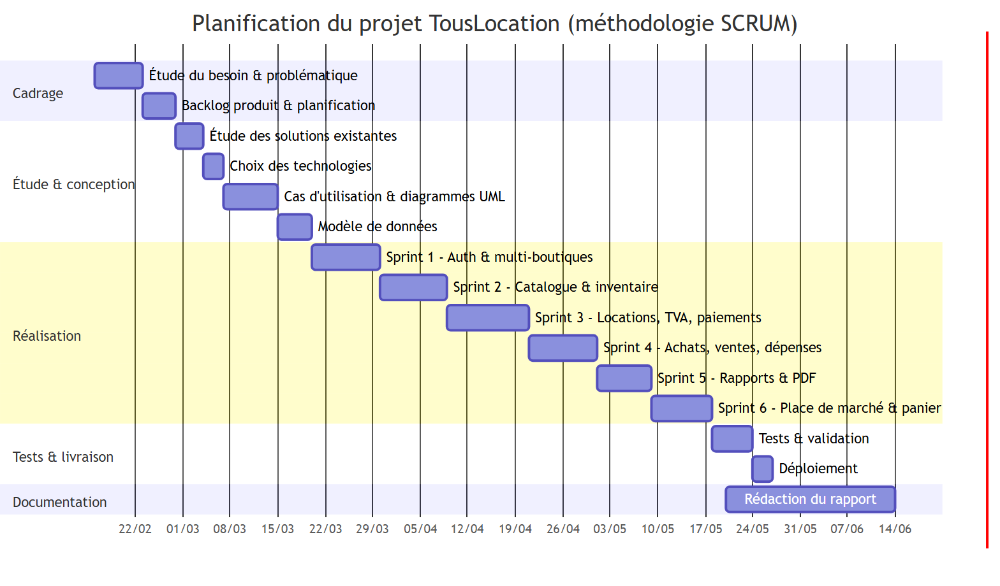
<p class="cap">Figure 1 — Diagramme de Gantt — planification des sprints</p>

### Conclusion du chapitre

Ce chapitre a défini le cadre du projet : sa problématique, ses objectifs, ses besoins
fonctionnels et non fonctionnels, ainsi que la méthodologie agile et la planification
retenues. Le chapitre suivant procède à l'étude préliminaire des solutions existantes et
justifie les choix technologiques.

<div class="page-break"></div>

## Chapitre 2 — Étude préliminaire et technologies

### Introduction du chapitre

Avant de concevoir et de développer l'application, il est essentiel d'étudier les
solutions déjà disponibles sur le marché, puis de choisir des technologies adaptées aux
besoins identifiés. Ce chapitre compare brièvement TousLocation aux solutions existantes,
puis présente et justifie les frameworks et outils retenus.

### 2.1 Étude des solutions existantes et similaires

Plusieurs catégories de solutions répondent partiellement au besoin de gestion de
location : les ERP généralistes, les logiciels de location spécialisés du marché
international, et les approches artisanales (papier / Excel). Le tableau ci-dessous les
compare et positionne TousLocation.

**Tableau 2 — Comparatif des solutions existantes**

| Solution | Atouts | Limites | Positionnement de TousLocation |
| -------- | ------ | ------- | ------------------------------ |
| Papier / Excel | Coût nul, prise en main immédiate | Erreurs, pas de contrôle de disponibilité, aucun reporting, non collaboratif | TousLocation automatise et fiabilise tout le cycle |
| ERP généralistes (type Odoo, ERPNext) | Très complets, modulaires | Lourds, coûteux à paramétrer, surdimensionnés pour une PME de location | TousLocation est ciblé, léger et immédiatement opérationnel |
| Logiciels de location spécialisés (solutions étrangères) | Métier bien couvert | Coûteux, en devises étrangères, peu adaptés au contexte marocain (Dirham, TVA, FR/AR) | TousLocation intègre nativement Dirham, TVA marocaine et bilinguisme |
| Solutions SaaS de réservation génériques | Hébergées, multi-clients | Non spécialisées location de matériel, pas de gestion de stock/achats | TousLocation couvre stock, achats, ventes et place de marché |

Cette analyse confirme l'intérêt d'une solution **sur mesure, légère et adaptée au
marché marocain**, couvrant l'ensemble du cycle métier tout en restant accessible
financièrement.

### 2.2 Présentation des technologies et frameworks retenus

#### 2.2.1 Frontend (React + Vite)

L'interface utilisateur est construite avec **React** associé au bundler **Vite**.
Comparé à **Angular** (plus structuré mais plus lourd) et à **Vue** (excellent mais à
écosystème plus restreint), **React** a été retenu pour la richesse de son écosystème, sa
grande communauté et son modèle par composants réutilisables, parfaitement adapté à une
**Single Page Application** réactive. **Vite** offre quant à lui un démarrage et un
rechargement à chaud très rapides, ce qui accélère sensiblement le développement.

#### 2.2.2 Backend (Laravel)

Le backend est développé avec **Laravel** (PHP), exposant une **API REST**. Comparé à
**Node.js / Express** (très flexible mais moins structurant) et à **Spring Boot** (robuste
mais plus verbeux et à courbe d'apprentissage plus longue), **Laravel** s'impose par son
écosystème mature, son ORM **Eloquent** expressif, sa sécurité intégrée (hachage,
validation, protection CSRF) et ses outils natifs (migrations, seeders, commandes
Artisan, authentification Sanctum). Ces atouts permettent un développement rapide et
fiable d'une API métier complète.

#### 2.2.3 Base de données (MySQL/MariaDB)

La persistance s'appuie sur **MySQL / MariaDB**, moteur **relationnel** transactionnel
(InnoDB). Comparé à **PostgreSQL** (excellent mais ici sans besoin de ses fonctions
avancées) et à **MongoDB** (NoSQL, inadapté à des données fortement relationnelles comme
les locations, lignes et paiements), **MySQL** a été choisi pour la nature **relationnelle**
du modèle (nombreuses clés étrangères et intégrité référentielle), sa parfaite intégration
avec Laravel et sa très large diffusion sur les hébergements.

### 2.3 Outils de développement et de collaboration

**Tableau 3 — Outils de développement et de collaboration**

| Catégorie | Outil | Usage |
| --------- | ----- | ----- |
| Éditeur de code | **VS Code** | Développement frontend et backend |
| Gestion de version | **Git / GitHub** | Versionnage et historique du code |
| Dépendances PHP | **Composer** | Installation des paquets Laravel |
| Dépendances JS | **npm** | Installation des paquets React/Vite |
| Test d'API | **Postman** | Vérification des endpoints REST |
| CLI Laravel | **Artisan** | Migrations, seeders, commandes d'import |
| Génération PDF | **dompdf** | Factures et reçus |
| Authentification | **Sanctum** | Jetons d'accès (Bearer) |

### Conclusion du chapitre

L'étude préliminaire a montré la pertinence d'une solution sur mesure et a justifié le
choix de la pile **React + Laravel + MySQL**, complétée par un outillage adapté. Le
chapitre suivant détaille l'analyse et la conception du système.

<div class="page-break"></div>

## Chapitre 3 — Analyse et conception

### Introduction du chapitre

Ce chapitre traduit les besoins en modèles d'analyse et de conception. Il identifie les
acteurs et leurs droits, présente les cas d'utilisation, illustre le déroulement d'une
opération clé par un diagramme de séquence, modélise les entités métier par un diagramme
de classes et décrit enfin le modèle physique de données.

### 3.1 Identification des acteurs et leurs rôles

Le système distingue quatre acteurs, dont les droits sont résumés ci-dessous.

**Tableau 4 — Acteurs, rôles et droits**

| Acteur | Rôle | Droits principaux |
| ------ | ---- | ----------------- |
| **Super-administrateur** | Supervision globale (SaaS) | Crée et gère les comptes gérants, supervise toutes les boutiques, gère les référentiels partagés |
| **Gérant / Manager** | Responsable d'une boutique | Gère son catalogue, ses locations, achats, ventes, dépenses, ajustements, rapports et employés (dans son espace isolé) |
| **Employé** | Opérateur quotidien | Opère selon les **modules autorisés** par le gérant : locations, paiements, matériel, etc. |
| **Client** | Utilisateur final | S'inscrit librement, parcourt la place de marché, commande via le panier et suit ses propres locations (toutes boutiques confondues) |

### 3.2 Diagrammes de cas d'utilisation

Le diagramme suivant synthétise les interactions entre les acteurs et les
fonctionnalités du système.


<p class="cap">Figure 2 — Diagramme de cas d'utilisation</p>

Pour préciser le fonctionnement attendu, deux cas d'utilisation majeurs sont décrits
textuellement ci-dessous.

#### Cas d'utilisation « Créer une location »

- **Acteur principal :** Employé (ou Gérant).
- **Pré-conditions :** l'utilisateur est authentifié et autorisé sur le module
  « locations » ; au moins un client et un matériel disponible existent dans la boutique.
- **Scénario nominal :**
  1. L'utilisateur ouvre l'écran « Locations » et lance la création d'une location.
  2. Il sélectionne le client puis la période (date de début et date de fin).
  3. Il ajoute un ou plusieurs articles via le sélecteur avancé.
  4. Le système vérifie la **disponibilité** de chaque article sur la période (réservations
     concurrentes et jours de battement).
  5. Le système calcule automatiquement le sous-total HT, la **TVA** et le total TTC.
  6. L'utilisateur valide ; le système enregistre la location et ses lignes dans une
     transaction.
- **Post-conditions :** la location est créée avec le statut initial, les articles sont
  réservés sur la période, et la facture PDF peut être générée.
- **Scénario alternatif :** si un article n'est pas disponible, le système le signale et
  empêche l'enregistrement tant que le conflit n'est pas résolu.

#### Cas d'utilisation « Commander via le panier (client) »

- **Acteur principal :** Client.
- **Pré-conditions :** le client est inscrit et authentifié ; la place de marché est
  accessible.
- **Scénario nominal :**
  1. Le client parcourt le **catalogue multi-boutiques** et utilise la recherche et le
     filtre par boutique.
  2. Il ajoute un ou plusieurs articles d'une **même boutique** à son **panier**.
  3. Il choisit une période commune (par défaut « maintenant », non modifiable vers le
     passé).
  4. Il confirme la commande ; le système vérifie que tous les articles appartiennent à
     une seule boutique et contrôle leur disponibilité.
  5. Le système crée la location, la rattache à la **boutique du produit** et la fait
     apparaître dans « Mes locations ».
- **Post-conditions :** la demande de location est enregistrée et visible côté client et
  côté gérant concerné.
- **Scénario alternatif :** si le panier contient des articles de boutiques différentes
  ou un article indisponible, le système refuse la confirmation et en informe le client.

### 3.3 Diagrammes de séquence

Le diagramme de séquence ci-dessous illustre le flux complet de **création d'une
location** depuis le panier client.


<p class="cap">Figure 3 — Diagramme de séquence — création d'une location</p>

Le flux se déroule ainsi : depuis le panier React, le client confirme la location ; la
requête `POST /locations` (avec jeton Bearer) traverse les routes puis le middleware
**Sanctum + TenantScoped** avant d'atteindre le `LocationController`. Ce dernier **valide**
les données et les dates, charge les modèles `Materiel` concernés, vérifie l'appartenance
à une **seule boutique** ainsi que la **disponibilité**, puis enregistre la location et ses
lignes dans une **transaction** MySQL. Le serveur répond par un code `201` accompagné de la
location et de ses montants, et l'interface affiche une confirmation à l'utilisateur.

### 3.4 Diagramme de classes

Le diagramme de classes ci-dessous modélise les entités métier (modèles Eloquent) et
leurs associations.


<p class="cap">Figure 4 — Diagramme de classes (UML)</p>

Les principales associations sont les suivantes : un **Utilisateur** (qui représente aussi
une boutique pour les gérants) possède ses **Matériels** et est rattaché à des référentiels
(`Categorie`, `Marque`, `Unite`, `Devise`, `Taxe`, `TypePaiement`). Une **Location** regroupe
plusieurs **LigneLocation** (chacune liée à un `Materiel`) ainsi que des **Paiement**, et peut
porter un **Contrat**. Les mêmes structures existent pour les **Achat** (avec `LigneAchat` et
`PaiementAchat`, rattachés à un `Fournisseur`) et les **Vente** (avec `LigneVente` et
`PaiementVente`). Les entités `Depense` et `AjustementStock` complètent le suivi de
l'inventaire. Les attributs calculés `montant_paye`, `montant_restant` et `statut_paiement`
sont dérivés des paiements de chaque opération.

### 3.5 Modèle physique de données

Le modèle physique de données adopte une **nomenclature 100 % française**.


<p class="cap">Figure 5 — Modèle physique de données</p>

Les tables métier sont : `utilisateurs`, `materiels`, `locations`, `lignes_location`,
`paiements`, `achats`, `lignes_achat`, `paiements_achat`, `ventes`, `lignes_vente`,
`paiements_vente`, `depenses`, `ajustements_stock`, `contrats`, `fournisseurs`, ainsi que
les référentiels `categories`, `marques`, `unites`, `devises`, `taxes` et `types_paiement`.

Les **encaissements** sont modélisés par trois tables distinctes — `paiements`
(locations), `paiements_achat` (achats) et `paiements_vente` (ventes) — ce qui permet le
suivi des **règlements partiels** (montant payé, montant restant, statut de paiement). La
quasi-totalité des tables porte une colonne **`proprietaire_id`** qui garantit
l'**isolation des données** entre boutiques (multi-tenant) : un gérant ne voit que les
lignes dont le `proprietaire_id` correspond à sa boutique, tandis que le super-admin
dispose d'une vue globale.

### Conclusion du chapitre

L'analyse et la conception étant posées — acteurs, cas d'utilisation, séquence, classes
et modèle de données — le chapitre suivant aborde la réalisation effective de
l'application.

<div class="page-break"></div>

## Chapitre 4 — Réalisation et implémentation

### Introduction du chapitre

Ce chapitre, le plus détaillé, décrit la mise en œuvre concrète de TousLocation : la
préparation de l'environnement, l'architecture générale, l'implémentation du backend et du
frontend illustrée par des **captures d'écran réelles**, puis les tests, la validation et
les difficultés rencontrées.

### 4.1 Mise en place de l'environnement de développement

L'environnement de développement repose sur **PHP 8.3** et **Composer** pour le backend,
**Node.js** et **npm** pour le frontend, **MySQL** pour la base de données, le tout piloté
depuis **VS Code**. Le backend Laravel est servi via `php artisan serve` et le frontend
React via `npm run dev` (Vite). La base est créée et alimentée par les migrations et
seeders Artisan.

```bash
# Backend (Laravel)
composer install
php artisan migrate --seed
php artisan serve

# Frontend (React + Vite)
npm install
npm run dev
```

### 4.2 Architecture générale de l'application

L'application suit une architecture **découplée** : une **SPA React** dialogue avec une
**API REST Laravel** par échanges JSON authentifiés par **jeton Bearer (Sanctum)** ;
côté serveur, les contrôleurs orchestrent la logique, l'ORM **Eloquent** accède à la base
**MySQL**, et des gabarits Blade génèrent les documents PDF.


<p class="cap">Figure 6 — Architecture technique (MVC) de l'application</p>

Le frontend joue le rôle de **Vue** principale ; il consomme le **Contrôleur** (API REST)
qui pilote le **Modèle** (Eloquent). Chaque requête métier traverse le middleware
d'authentification **Sanctum** et le trait **TenantScoped** qui assure l'isolation
multi-boutiques. Les gabarits **Blade** servent uniquement à produire les factures et
reçus PDF via **dompdf**.

### 4.3 Implémentation du backend

Le backend Laravel est entièrement écrit selon une **nomenclature française** : modèles
Eloquent (`Utilisateur`, `Materiel`, `Location`, `Achat`, `Vente`…), contrôleurs REST,
routes en français (`/connexion`, `/materiels`, `/locations`, `/achats`, `/ventes`…). La
sécurité repose sur **Sanctum** (jetons), une **validation systématique** des requêtes,
et le trait **`TenantScoped`** qui filtre automatiquement les données par
`proprietaire_id`. La génération des documents PDF s'appuie sur **dompdf**, et des
**commandes Artisan** d'import (`demo:makita`, `demo:transpalette`) permettent de charger
des catalogues réels via le service `CatalogImporter`. À la création d'une boutique, le
service `TenantProvisioner` initialise automatiquement ses devises, taxes, unités, types
de paiement et catégories.

Extrait simplifié du trait **TenantScoped**, qui restreint chaque requête à la boutique
de l'utilisateur connecté :

```php
trait TenantScoped
{
    // Restreint une requête aux données de la boutique courante
    protected function scopeToTenant($query)
    {
        $user = request()->user();
        if ($user->isSuperAdmin()) {
            return $query; // le super-admin voit tout
        }
        return $query->where('proprietaire_id', $this->ownerId());
    }

    protected function ownerId(): int
    {
        $user = request()->user();
        return $user->isManager() ? $user->id : $user->proprietaire_id;
    }
}
```

Extrait simplifié d'un contrôleur (création d'une location avec validation, contrôle de
disponibilité et transaction) :

```php
public function store(Request $request)
{
    $data = $request->validate([
        'client_id'  => 'required|exists:utilisateurs,id',
        'date_debut' => 'required|date',
        'date_fin'   => 'required|date|after_or_equal:date_debut',
        'lignes'     => 'required|array|min:1',
    ]);

    return DB::transaction(function () use ($data) {
        $location = Location::create([
            'proprietaire_id' => $this->ownerId(),
            'client_id'       => $data['client_id'],
            'date_debut'      => $data['date_debut'],
            'date_fin'        => $data['date_fin'],
            'statut'          => 'pending',
        ]);
        // ... création des lignes + contrôle de disponibilité
        return response()->json($location, 201);
    });
}
```

### 4.4 Implémentation du frontend web

Le frontend est une **SPA React** propulsée par **Vite**, utilisant **React Router** pour
la navigation, **Axios** (avec un **intercepteur** ajoutant le jeton Bearer et redirigeant
sur expiration) pour les appels API, et **react-i18next** pour le bilinguisme
**français/arabe (RTL)**. L'interface se répartit en **trois espaces** : un **espace
public**, un **espace staff** (super-admin, gérant, employé) organisé autour d'un *layout*
commun à barre latérale filtrée par permissions, et un **espace client** (place de marché
et « Mes locations »).

#### Espace public

L'espace public accueille les visiteurs, présente les boutiques et permet la connexion et
l'inscription des clients.

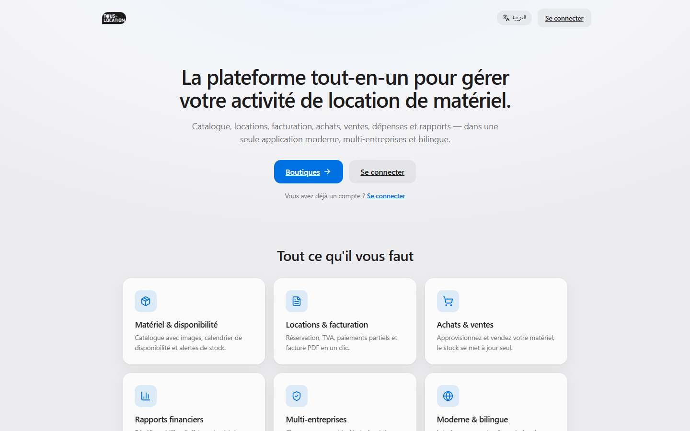
<p class="cap">Figure 7 — Page d'accueil (espace public)</p>

La **page d'accueil** présente l'application et oriente le visiteur vers la connexion, la
vitrine des boutiques ou l'inscription, avec un sélecteur de langue (FR/AR).

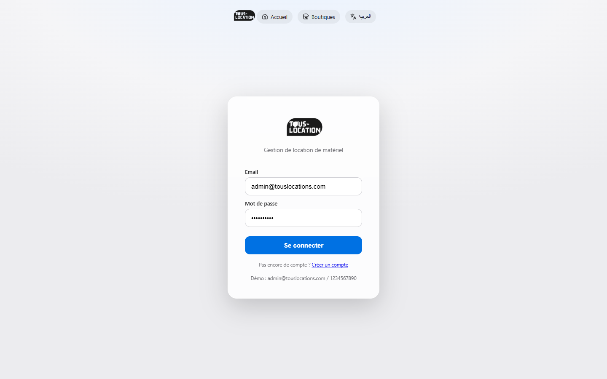
<p class="cap">Figure 8 — Page de connexion</p>

La **page de connexion** authentifie l'utilisateur : à la saisie de l'e-mail et du mot de
passe, l'application reçoit un jeton et redirige vers l'espace correspondant au rôle.

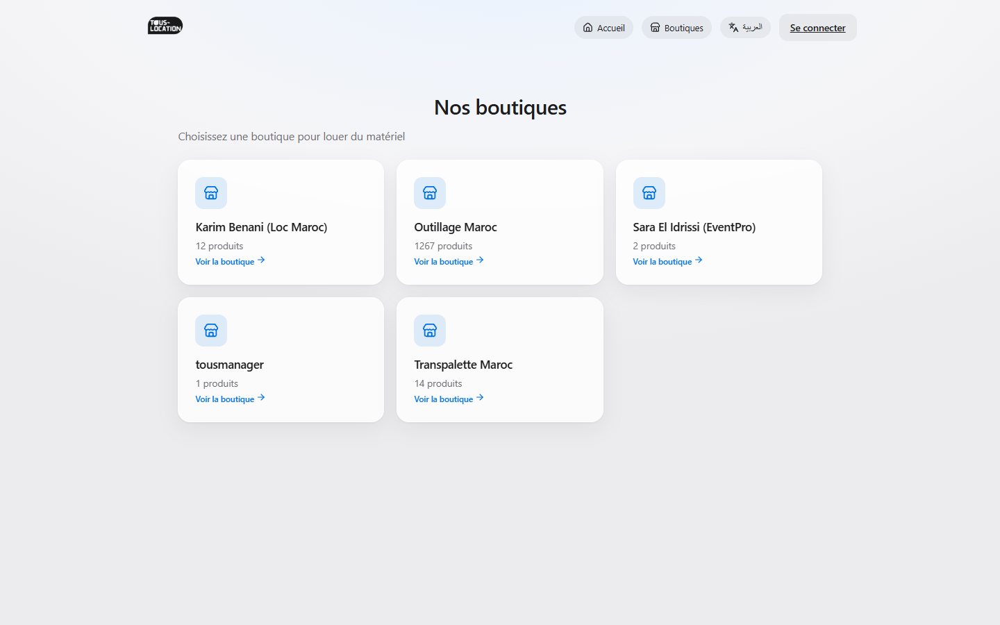
<p class="cap">Figure 9 — Vitrine des boutiques publiques</p>

La **vitrine des boutiques** liste les boutiques disponibles et permet d'accéder à leur
catalogue avant même de s'inscrire.

#### Espace staff (gestion)

L'espace staff regroupe les écrans de gestion quotidienne de la boutique.

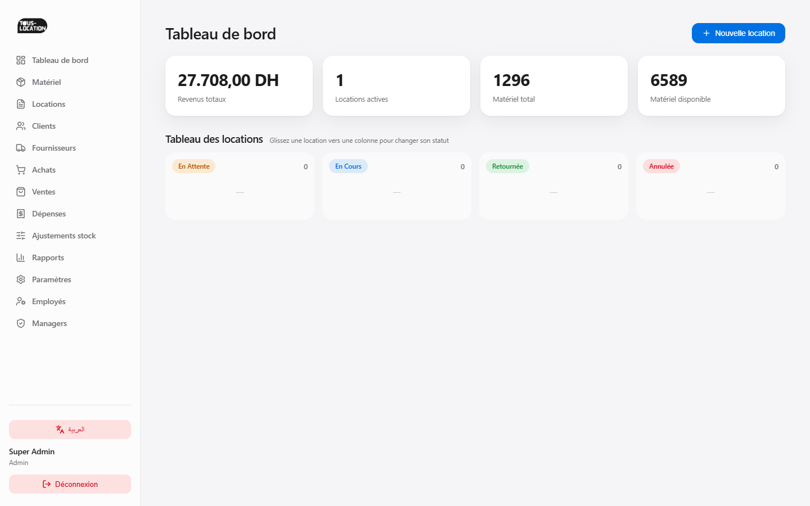
<p class="cap">Figure 10 — Tableau de bord (espace staff)</p>

Le **tableau de bord** affiche les indicateurs clés (revenus, locations, stock) et un
suivi visuel des locations par statut, point d'entrée de la gestion.

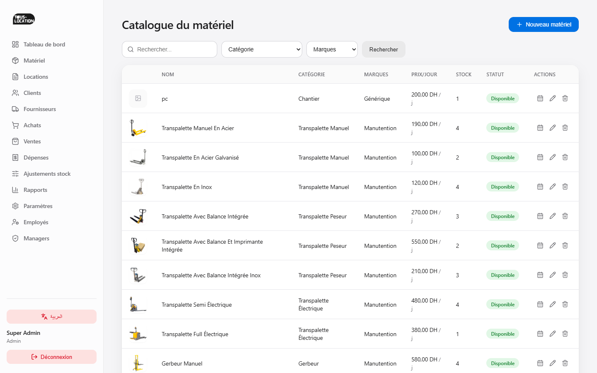
<p class="cap">Figure 11 — Catalogue du matériel</p>

L'écran **Matériel** permet la gestion complète du catalogue (CRUD, images, catégories,
marques, unités) ainsi que la consultation de la disponibilité.

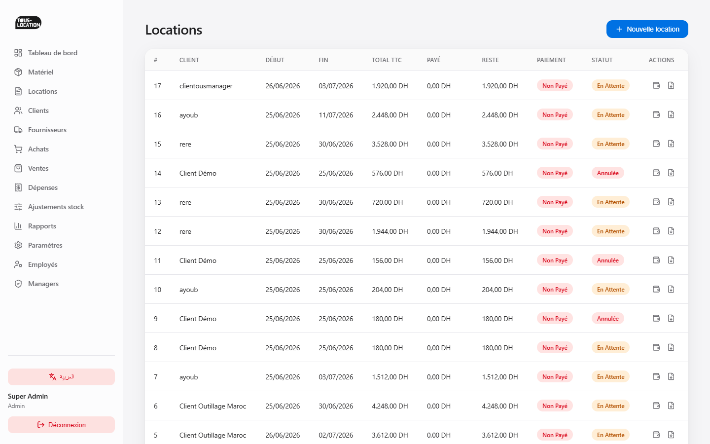
<p class="cap">Figure 12 — Gestion des locations</p>

L'écran **Locations** orchestre la réservation multi-articles, le contrôle de
disponibilité, le calcul de la TVA, le suivi des paiements partiels et la génération de la
facture PDF.

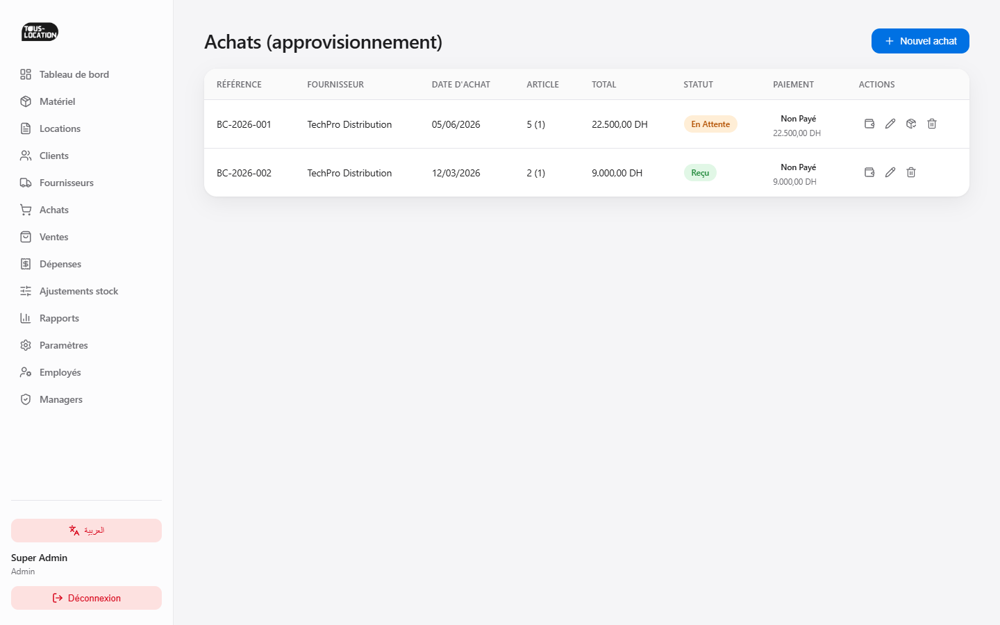
<p class="cap">Figure 13 — Gestion des achats</p>

L'écran **Achats** gère les commandes auprès des fournisseurs : à la réception, le stock
est alimenté et les encaissements partiels sont suivis.

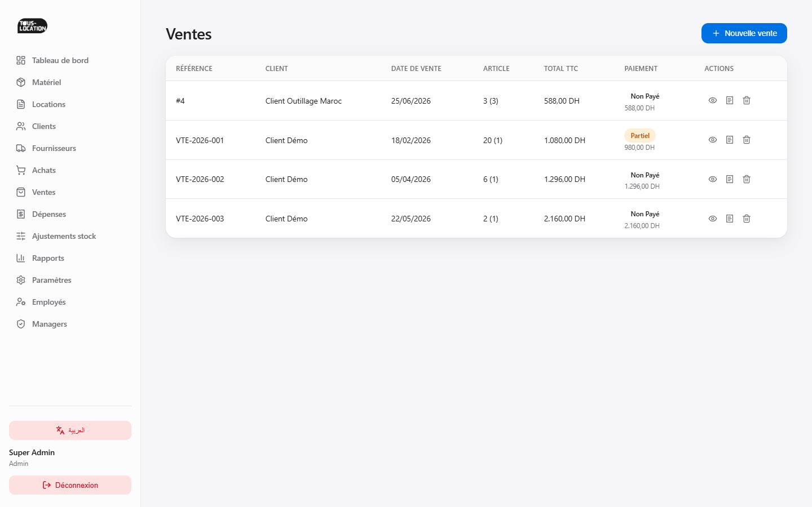
<p class="cap">Figure 14 — Gestion des ventes</p>

L'écran **Ventes** enregistre les ventes de matériel avec décrément du stock, suivi des
encaissements et génération d'un reçu PDF.

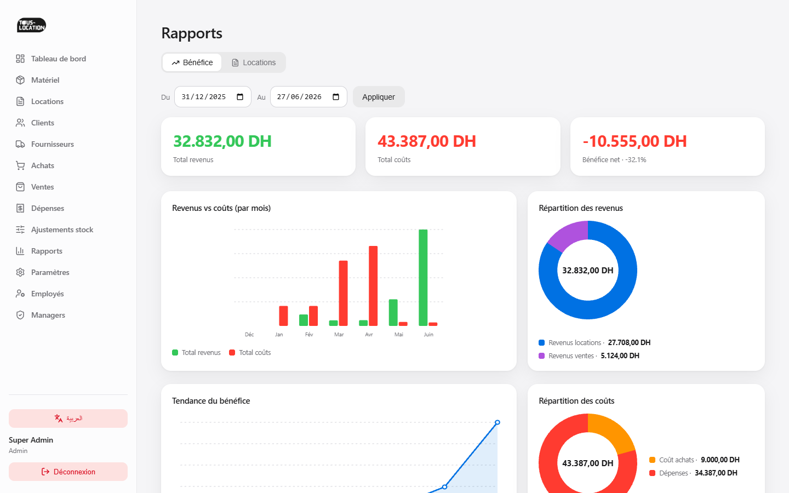
<p class="cap">Figure 15 — Rapports et statistiques</p>

L'écran **Rapports** restitue, sur une période choisie, le bénéfice (revenus − coûts), le
chiffre d'affaires, l'encaissé / le reste à encaisser et la répartition des locations.

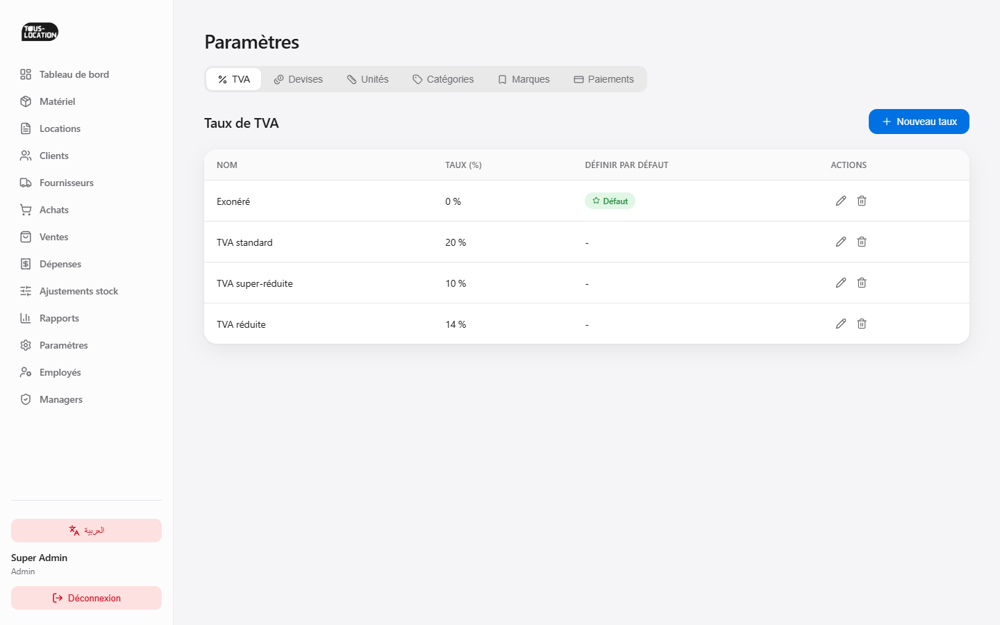
<p class="cap">Figure 16 — Paramètres et référentiels</p>

L'écran **Paramètres** centralise la gestion des référentiels (TVA, devises, unités,
catégories, marques, types de paiement) par onglets.

#### Espace client

L'espace client expose la place de marché et le suivi des locations du client.

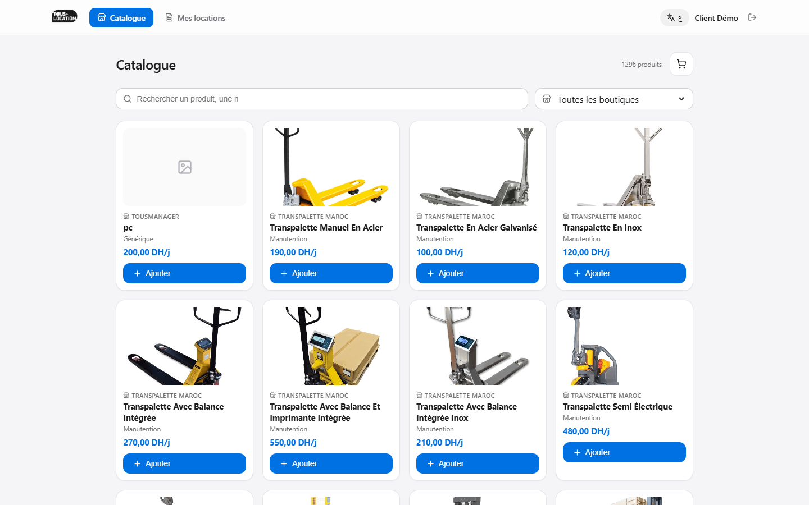
<p class="cap">Figure 17 — Place de marché client (panier)</p>

La **place de marché** propose un catalogue multi-boutiques avec recherche et filtre par
boutique ; le client ajoute plusieurs articles d'une même boutique à son **panier** avant
de confirmer sa location sur une période commune.

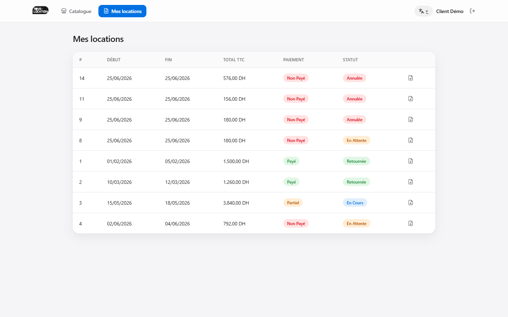
<p class="cap">Figure 18 — Mes locations (espace client)</p>

L'écran **Mes locations** permet au client de suivre l'état de ses demandes et locations,
toutes boutiques confondues.

### 4.5 Tests et validation

L'application a fait l'objet de **tests fonctionnels manuels** sur l'ensemble des
workflows. Les opérations **CRUD** de chaque module (matériel, locations, achats, ventes,
dépenses, ajustements, référentiels) ont été vérifiées (création, lecture, modification,
suppression). L'**isolation multi-tenant** a été contrôlée en s'assurant qu'un gérant ne
peut accéder aux données d'une autre boutique (réponse 404 sur accès croisé). Le **contrôle
de disponibilité** a été validé en testant des réservations concurrentes et le délai de
battement. Enfin, la **validation des paiements** partiels (montant payé, restant, statut)
et les calculs de TVA ont été confirmés sur les locations, achats et ventes. L'ensemble de
ces tests a été **validé** avec succès.

### 4.6 Difficultés rencontrées et solutions apportées

**Tableau 5 — Difficultés rencontrées et solutions apportées**

| Problème | Solution apportée |
| -------- | ----------------- |
| Calcul de la disponibilité réelle sur une période | Prise en compte des réservations concurrentes et d'un **délai de battement** (jours tampon), vérifiée côté serveur. |
| Isolation des données entre boutiques | Colonne `proprietaire_id` + filtrage automatique via le trait **TenantScoped** (404 sur accès croisé). |
| Cohérence d'une nomenclature française | Élaboration d'un référentiel de nomenclature unique appliqué à toutes les couches (tables, modèles, contrôleurs, routes, vues). |
| Commande client multi-boutiques | Contrôle imposant un **panier d'une seule boutique** ; la location est rattachée à la boutique du produit. |
| Déploiement de l'application | Procédure d'installation et de configuration automatisée (migrations, seeders, build du frontend). |

### Conclusion du chapitre

Ce chapitre a présenté la réalisation concrète de l'application : environnement,
architecture, implémentation du backend et du frontend illustrée par les écrans réels,
tests et difficultés. Tous les modules planifiés ont été développés et validés.

<div class="page-break"></div>

## Conclusion et perspectives

### Bilan du projet

Ce projet de fin d'études a permis de concevoir et de réaliser **TousLocation**, une
application web complète et professionnelle de gestion de location de matériel. De
l'analyse du besoin au déploiement, l'ensemble du cycle de développement a été couvert en
mobilisant des technologies modernes (**Laravel, React, MySQL**) et de bonnes pratiques
(architecture MVC, API REST, sécurité, multi-tenant). **Tous les objectifs fixés ont été
atteints** : la gestion complète du cycle de location, les **encaissements partiels** sur
les locations, achats et ventes, les **documents PDF** (facture et reçu), la **place de
marché client** multi-boutiques (catalogue, recherche, panier multi-articles), l'isolation
des données par boutique (SaaS) et l'interface bilingue français/arabe.

### Limites et améliorations futures

Plusieurs perspectives d'évolution sont envisageables :

- intégration du **paiement en ligne** ;
- **notifications automatiques** (confirmations, rappels de retour, alertes de retard) ;
- développement d'une **application mobile** native ;
- **export Excel** et graphiques d'évolution des rapports (revenus, bénéfice).

### Compétences développées

Sur le plan personnel, ce travail a renforcé mes compétences en **développement
full-stack** (React et Laravel), en **conception de bases de données** relationnelles, en
**conception logicielle** (UML, architecture MVC, API REST) et en **conduite de projet
agile**, tout en développant mon autonomie, ma rigueur et ma capacité à résoudre des
problèmes techniques concrets.

En définitive, TousLocation constitue une base solide, fonctionnelle et évolutive,
répondant concrètement aux besoins des entreprises de location de matériel.

<div class="page-break"></div>

## Références bibliographiques et webographiques

- Documentation officielle **Laravel** — https://laravel.com/docs
- Documentation officielle **React** — https://react.dev
- Documentation **Vite** — https://vite.dev
- Documentation **MySQL** — https://dev.mysql.com/doc
- Documentation **Laravel Sanctum** — https://laravel.com/docs/sanctum
- **MDN Web Docs** — https://developer.mozilla.org
- **react-i18next** — https://react.i18next.com

## Annexes

- **Annexe A — Comptes de démonstration**

**Tableau 6 — Comptes de démonstration**

| Rôle | Identifiant | Mot de passe |
| ---- | ----------- | ------------ |
| Super-administrateur | admin@touslocations.com | 1234567890 |
| Manager | manager@touslocations.com | 1234567890 |
| Employé | employe@touslocations.com | 1234567890 |
| Client | client@touslocations.com | 1234567890 |

- **Annexe B — Extraits de code** : trait `TenantScoped` et contrôleur de création de
  location (section 4.3), illustrant l'isolation multi-tenant et la logique métier.
- **Annexe C — Dépôt du code source** : l'intégralité du code (backend Laravel et frontend
  React) est versionnée sous **Git** et hébergée sur **GitHub**.

<p class="center" style="margin-top:30px;color:#888;font-size:11px;">— Fin du rapport —</p>
