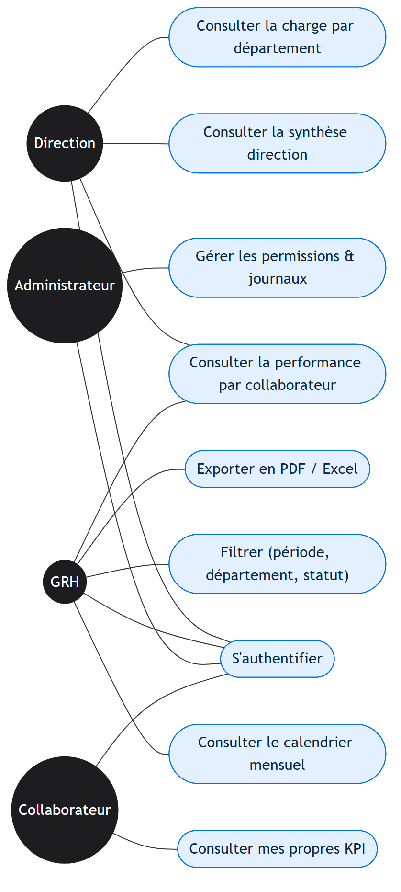
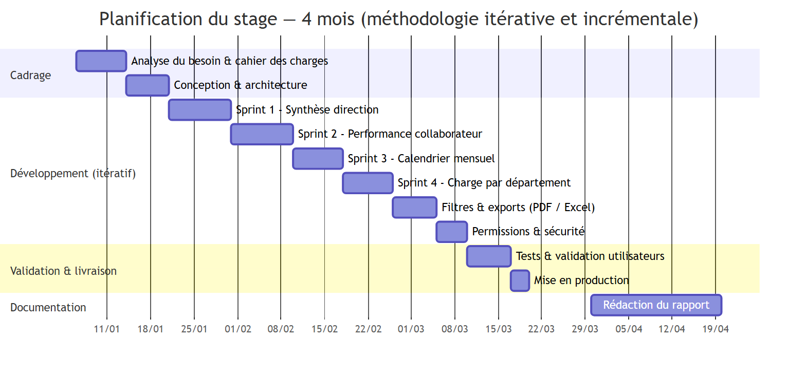
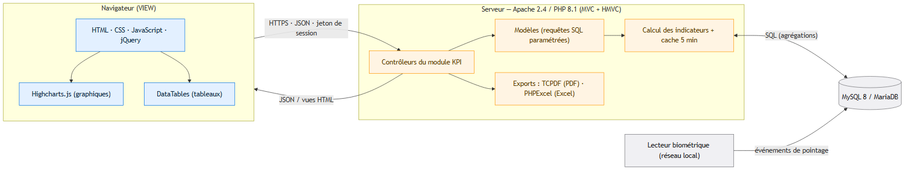

---
pdf_options:
  format: A4
  margin: 20mm
  printBackground: true
css: |
  body { font-family: "Times New Roman", Georgia, serif; color: #1a1a1a; line-height: 1.6; font-size: 13px; text-align: justify; }
  h1 { font-size: 22px; }
  h2 { font-size: 17px; border-bottom: 2px solid #0071e3; padding-bottom: 4px; margin-top: 26px; color: #0a2540; }
  h3 { font-size: 14px; margin-top: 16px; color: #1a3a5c; }
  h4 { font-size: 13px; margin: 12px 0 2px; color: #0a2540; }
  a { color: #0071e3; text-decoration: none; }
  img { max-width: 100%; display: block; margin: 10px auto; }
  .cap { text-align: center; font-size: 11px; color: #555; font-style: italic; margin: 4px 0 14px; }
  table { border-collapse: collapse; width: 100%; font-size: 11.5px; margin: 10px 0; }
  th, td { border: 1px solid #c9c9c9; padding: 6px 9px; text-align: left; vertical-align: top; }
  th { background: #eef4fb; }
  ul, ol { margin: 6px 0 6px 18px; }
  blockquote { border-left: 3px solid #0071e3; margin: 10px 0; padding: 4px 12px; color: #444; background: #f7faff; }
  pre { background: #f6f8fa; border: 1px solid #e1e4e8; border-radius: 6px; padding: 10px 12px; font-size: 11px; overflow: auto; break-inside: avoid; page-break-inside: avoid; }
  code { font-family: "Consolas", monospace; font-size: 11px; }
  .page-break { page-break-after: always; }
  .center { text-align: center; }
  .cover { text-align: center; }
  .cover h1 { font-size: 26px; margin: 10px 0 2px; color: #0a2540; }
  .cover .sub { font-size: 16px; color: #444; }
  .cover .school { font-size: 15px; font-weight: bold; letter-spacing: .5px; }
  .cover .infos { margin-top: 36px; font-size: 14px; line-height: 2; text-align: left; display: inline-block; }
  .cover .yr { margin-top: 36px; font-size: 14px; font-weight: bold; }
  .quote-ded { font-style: italic; text-align: center; line-height: 2; font-size: 14px; }
  /* Eviter les coupures de figures et de tableaux entre les pages */
  figure.fig { break-inside: avoid; page-break-inside: avoid; margin: 14px 0; text-align: center; }
  figure.fig img { margin: 0 auto; max-height: 225mm; width: auto; }
  figure.fig .cap { margin-top: 4px; }
  img { break-inside: avoid; page-break-inside: avoid; max-height: 225mm; }
  .cap { break-before: avoid; page-break-before: avoid; }
  table { page-break-inside: auto; }
  tr, th, td { break-inside: avoid; page-break-inside: avoid; }
  thead { display: table-header-group; }
  h2, h3, h4 { break-after: avoid; page-break-after: avoid; }
---

<div class="cover">

<p class="school">OFFICE DE LA FORMATION PROFESSIONNELLE ET DE LA PROMOTION DU TRAVAIL<br/>INSTITUT SPÉCIALISÉ DE TECHNOLOGIE APPLIQUÉE<br/>ISTA — CASABLANCA</p>

<p class="sub">Filière : Développement Digital</p>

<p style="font-size:13px;color:#0071e3;font-weight:bold;letter-spacing:1px;margin-top:30px;">RAPPORT DE STAGE DE FIN DE FORMATION</p>

# Conception et développement d'un tableau de bord analytique des indicateurs de performance (KPI) des collaborateurs

<p style="font-size:14px;color:#444;margin-top:4px;">Module HR Analytics intégré à la plateforme interne</p>

<p class="infos">
<strong>Réalisé par&nbsp;:</strong> &nbsp;Youssef EL WAFI<br/>
<strong>Entreprise d'accueil&nbsp;:</strong> &nbsp;MSINVEST<br/>
<strong>Période du stage&nbsp;:</strong> &nbsp;Janvier 2026 – Avril 2026<br/>
<strong>Encadrant entreprise&nbsp;:</strong> &nbsp;M. Larbi ELHABTI<br/>
<strong>Encadrant pédagogique&nbsp;:</strong> &nbsp;…………………………………<br/>
<strong>Établissement&nbsp;:</strong> &nbsp;OFPPT – ISTA, Casablanca
</p>

<p class="yr">Année de formation : 2025 / 2026</p>

</div>

<div class="page-break"></div>

## Dédicaces

<p class="quote-ded">
À mes chers <strong>parents</strong>, pour leur soutien indéfectible, leur patience et leurs
encouragements tout au long de mon parcours académique&nbsp;;<br/><br/>
À mes <strong>enseignants de l'ISTA</strong>, qui m'ont transmis les connaissances techniques et
les valeurs professionnelles indispensables pour mener à bien ce projet&nbsp;;<br/><br/>
À l'équipe de <strong>MSINVEST</strong>, qui m'a accueilli avec bienveillance et m'a fait
confiance pour conduire ce projet de bout en bout&nbsp;;<br/><br/>
À mes <strong>amis</strong> et à toutes les personnes qui ont contribué, de près ou de loin, à la
réussite de ce stage.
</p>

<div class="page-break"></div>

## Remerciements

Avant tout développement, je tiens à exprimer ma sincère gratitude à l'équipe de **MSINVEST**
pour l'accueil chaleureux et les excellentes conditions de travail qui ont accompagné ce stage.

Je remercie tout particulièrement **Monsieur Larbi ELHABTI**, mon encadrant entreprise, pour la
confiance qu'il m'a accordée en me confiant la conception et la mise en production du tableau de
bord analytique. Son suivi attentif, ses orientations techniques et la liberté d'initiative qu'il m'a
laissée ont été déterminants pour l'aboutissement de ce travail.

Mes remerciements s'adressent également aux équipes **Opérations**, **Ressources Humaines** et
**Comptabilité**, dont les retours utilisateurs ont orienté les choix fonctionnels et ergonomiques
du module.

Je tiens enfin à remercier le **corps pédagogique et l'ensemble du personnel de l'OFPPT – ISTA**
pour la formation théorique et pratique qui m'a permis d'aborder ce stage avec les compétences
nécessaires.

<div class="page-break"></div>

## Résumé

Ce rapport présente le travail réalisé durant un stage de **quatre mois** au sein de **MSINVEST**,
consacré à la **conception et au développement d'un tableau de bord analytique des indicateurs de
performance (KPI) des collaborateurs**.

Le module développé centralise les données opérationnelles et RH (présence, productivité, charge
de travail, dossiers traités) au sein d'une interface unique, accessible à la direction et au
département GRH. Il s'appuie sur un socle **PHP open-source en architecture MVC** et puise les
données de pointage dans un **lecteur biométrique** connecté en réseau local.

Le rapport détaille la démarche méthodologique adoptée, l'architecture logicielle, les choix de
visualisation, les difficultés rencontrées et les résultats observés sur le terrain.

**Mots-clés :** KPI, tableau de bord, MVC, PHP, MySQL, pointage biométrique, ressources humaines,
analyse de productivité, TCPDF.

### Abstract

This report presents the work carried out during a **four-month internship** at **MSINVEST**,
dedicated to the **design and development of an analytical dashboard for employees' key
performance indicators (KPI)**. The module centralizes operational and HR data (attendance,
productivity, workload, processed cases) within a single interface accessible to management and the
HR department. It is built on an **open-source PHP MVC** foundation and draws clocking data from a
**biometric reader** connected over the local network. The report details the methodology, the
software architecture, the visualization choices, the difficulties encountered and the results
observed in the field.

**Keywords:** KPI, dashboard, MVC, PHP, MySQL, biometric clocking, human resources, productivity
analysis, TCPDF.

<div class="page-break"></div>

## Sommaire

- **Introduction générale**
- **Chapitre 1 — Présentation de l'organisme d'accueil**
- **Chapitre 2 — Contexte et cahier des charges du projet**
- **Chapitre 3 — Conception et architecture**
- **Chapitre 4 — Réalisation et implémentation**
- **Chapitre 5 — Tests, validation et résultats**
- **Conclusion générale et perspectives**
- **Annexes**

### Liste des figures

| N° | Figure |
| -- | ------ |
| Figure 1 | Diagramme de cas d'utilisation du module KPI |
| Figure 2 | Diagramme de Gantt — planification du stage (4 mois) |
| Figure 3 | Architecture technique du module (MVC / HMVC) |

### Liste des abréviations

| Abréviation | Signification |
| ----------- | ------------- |
| API | Application Programming Interface |
| BI | Business Intelligence |
| CDD | Contrat à Durée Déterminée |
| CDI | Contrat à Durée Indéterminée |
| CRUD | Create, Read, Update, Delete |
| CSS | Cascading Style Sheets |
| FK | Foreign Key |
| GRH | Gestion des Ressources Humaines |
| HMVC | Hierarchical Model View Controller |
| HR | Human Resources |
| HTTP | HyperText Transfer Protocol |
| ISTA | Institut Spécialisé de Technologie Appliquée |
| JSON | JavaScript Object Notation |
| KPI | Key Performance Indicator |
| LAMP | Linux / Apache / MySQL / PHP |
| MVC | Modèle Vue Contrôleur |
| PDF | Portable Document Format |
| SQL | Structured Query Language |
| UI | User Interface |
| UX | User Experience |

<div class="page-break"></div>

## Introduction générale

Le pilotage moderne des ressources humaines repose sur la capacité à mesurer, suivre et restituer
en temps réel un ensemble d'indicateurs de performance. Lorsqu'elles sont éparpillées entre
tableurs, registres papier et fichiers de pointage, ces données perdent leur valeur opérationnelle :
la prise de décision devient lente, approximative et dépendante de quelques personnes.

C'est dans ce contexte que **MSINVEST** a souhaité se doter d'un **tableau de bord analytique
unique**, accessible aux décideurs, capable d'afficher en temps réel les indicateurs clés de chaque
collaborateur — présence, retards, charge de travail, dossiers traités, heures supplémentaires.

Le stage, d'une durée de **quatre mois**, avait pour mission la conception, le développement et la
mise en production de ce module d'analyse, intégré à la plateforme interne de l'entreprise.

Ce rapport retrace la démarche suivie tout au long du projet. Le **chapitre 1** présente l'organisme
d'accueil. Le **chapitre 2** définit la problématique et le cahier des charges. Le **chapitre 3**
expose l'architecture retenue. Le **chapitre 4** détaille l'implémentation. Le **chapitre 5**
présente les tests et résultats observés. Une **conclusion générale** ouvre enfin sur les
perspectives d'évolution.

<div class="page-break"></div>

## Chapitre 1 — Présentation de l'organisme d'accueil

### 1.1 Identification

**MSINVEST** est une société marocaine évoluant dans le secteur des **services professionnels**.
Elle s'appuie sur un réseau de collaborateurs terrain et sur une équipe administrative centralisée
qui assure le suivi des dossiers clients, la facturation et la gestion du personnel.

### 1.2 Activités principales

Le cycle opérationnel couvre l'ouverture des dossiers clients, l'exécution des missions sur le
terrain, la facturation des prestations, l'encaissement des règlements et le suivi comptable. La
diversité de la clientèle et le volume important des dossiers traités exigent des outils de gestion
robustes et scalables.

### 1.3 Organisation interne

L'entreprise se structure autour des services suivants :

- **Direction générale** — pilotage stratégique, arbitrages.
- **Opérations** — exécution et suivi des missions terrain.
- **Comptabilité & Finance** — facturation, encaissement, reporting.
- **Ressources Humaines** — recrutement, paie, congés, formation.
- **Système d'Information** — support technique et maintenance.

### 1.4 Cadre du stage

Le stage s'inscrit dans la démarche de **digitalisation du système d'information** de l'entreprise.
Le projet de tableau de bord analytique vient compléter une plateforme métier déjà en place qui
couvre la facturation, le pointage et la paie. L'ambition était d'en exploiter les données pour
offrir aux décideurs une vue agrégée et temps réel de l'activité.

<div class="page-break"></div>

## Chapitre 2 — Contexte et cahier des charges

### 2.1 Problématique

Avant ce projet, les indicateurs RH étaient calculés **manuellement** à partir d'exports CSV,
croisés dans des tableurs et envoyés par e-mail à la direction sous forme de rapports mensuels. Ce
mode de fonctionnement présentait plusieurs limites :

- **Latence** — les indicateurs étaient connus avec un mois de retard.
- **Fiabilité** — chaque export manuel introduisait un risque d'erreur.
- **Centralisation** — la connaissance dépendait d'une seule personne.
- **Granularité** — pas d'analyse par département, par expert, ni par jour.
- **Accessibilité** — uniquement disponible en réunion ou sur demande.

### 2.2 Objectifs du projet

1. **Centraliser** les données opérationnelles et RH dans un module unique au sein de la plateforme existante.
2. **Automatiser** le calcul des indicateurs de performance (présence, retards, productivité, charge de travail).
3. **Visualiser** les KPI sous forme de graphiques, tableaux de chiffres et grilles colorées, par département et par collaborateur.
4. **Filtrer** sur la période, le département, le statut contractuel et le rôle.
5. **Exporter** les vues consolidées en PDF et Excel pour transmission et archivage.

### 2.3 Cahier des charges fonctionnel

| Domaine | Indicateurs / fonctionnalités |
| ------- | ----------------------------- |
| Présence | Heures travaillées, retards, absences, demi-journées, vue calendrier mensuelle, statut journalier. |
| Productivité | Nombre de dossiers traités par expert, par type de prestation, par période ; durée moyenne de traitement. |
| Charge de travail | Répartition par département, taux d'occupation, alertes de surcharge. |
| Synthèse direction | Carte de performance globale : top performers, départements les plus actifs, évolution mois par mois. |
| Export | PDF, Excel, sauvegarde des vues filtrées. |
| Permissions | Vue complète pour la direction et le GRH ; vue restreinte (mes propres KPI) pour les collaborateurs. |

Les acteurs du système et leurs interactions avec le module sont synthétisés par le diagramme de
cas d'utilisation suivant.

<figure class="fig">

<p class="cap">Figure 1 — Diagramme de cas d'utilisation du module KPI</p>
</figure>

### 2.4 Contraintes techniques

- **Sécurité** — accès contrôlé par les rôles existants ; chiffrement HTTPS ; mots de passe hachés (bcrypt).
- **Performance** — chargement des vues en moins de 3 secondes avec un parc de 30+ collaborateurs et 12 mois de données.
- **Maintenabilité** — code séparé du cœur applicatif pour ne pas être impacté par les mises à jour.
- **Compatibilité** — réutilisation du modèle de données existant ; aucune duplication.
- **Légalité** — respect du code du travail marocain pour le calcul des heures supplémentaires et de l'ancienneté.

### 2.5 Méthodologie adoptée et planification

La méthodologie suivie est **itérative et incrémentale**. Chaque indicateur a été développé selon
le cycle : étude du besoin, prototypage rapide, démonstration, recueil du retour, ajustement, mise
en production, suivi. Cette approche a permis de livrer de la valeur dès les premières semaines.

Le projet a été conduit **sur une durée de quatre mois** (de janvier à avril 2026). Le diagramme de
Gantt ci-dessous en présente l'ordonnancement, du cadrage jusqu'à la mise en production et à la
rédaction du rapport.

<figure class="fig">

<p class="cap">Figure 2 — Diagramme de Gantt — planification du stage (4 mois)</p>
</figure>

<div class="page-break"></div>

## Chapitre 3 — Conception et architecture

### 3.1 Vue d'ensemble

Le module repose sur une architecture **LAMP classique** (Linux, Apache, MySQL, PHP) et s'insère
dans un framework PHP open-source en **MVC**, étendu par le motif **HMVC**. Le code spécifique au
projet est isolé dans un module dédié, ce qui permet de mettre à jour le socle applicatif sans
perdre les fonctionnalités développées.

<figure class="fig">

<p class="cap">Figure 3 — Architecture technique du module (MVC / HMVC)</p>
</figure>

### 3.2 Pile technique

| Couche | Technologie | Rôle |
| ------ | ----------- | ---- |
| Système d'exploitation | Linux | Hébergement VPS sécurisé. |
| Serveur HTTP | Apache 2.4 | Routage HTTPS, vhosts. |
| Langage serveur | PHP 8.1 | Logique applicative, calcul des KPI. |
| Framework | Framework PHP MVC + HMVC | Organisation modulaire. |
| Base de données | MySQL 8 / MariaDB | Persistance et agrégations SQL. |
| Front-end | HTML, CSS, JavaScript, jQuery | Interface utilisateur. |
| Visualisation | Highcharts.js | Graphiques interactifs (lignes, barres, donut). |
| Tableaux | DataTables | Tableaux paginés, filtres, recherche. |
| Export PDF | TCPDF | Rapports consolidés. |
| Export Excel | PHPExcel | Données brutes pour la comptabilité. |

### 3.3 Modèle de données — vue simplifiée

Le module **ne crée pas de tables redondantes** : il s'appuie sur les données déjà collectées par
les autres modules de la plateforme.

| Source de données | Utilisation côté KPI |
| ----------------- | -------------------- |
| Table des collaborateurs | Liste, départements, ancienneté, statut contractuel. |
| Événements de pointage bruts | Calcul des heures travaillées, retards, pauses. |
| Agrégat quotidien de présence | Vue rapide par jour, statut (présent / absent / demi-journée). |
| Demandes de congé | Décompte des absences justifiées. |
| Dossiers / missions | Productivité par collaborateur et par type de prestation. |
| Bulletins de paie | Coût salarial mensuel, heures supplémentaires payées. |

### 3.4 Logique de calcul des indicateurs

Chaque indicateur est calculé **à la volée** par requête SQL paramétrée, puis sérialisé en **JSON**
pour alimenter les graphiques côté navigateur. Les vues sont **cachées 5 minutes** pour ne pas
surcharger la base lors des consultations répétées par plusieurs administrateurs.

<div class="page-break"></div>

## Chapitre 4 — Réalisation et implémentation

### 4.1 Environnement de développement

- Éditeur **Visual Studio Code** avec extensions PHP et JavaScript.
- Serveur local **XAMPP** pour développement et tests hors ligne.
- **Git** pour le versionnage du code source.
- Client **SSH** pour administrer le serveur et déployer les mises à jour.
- **Postman** pour tester les endpoints REST internes du module.

### 4.2 Vue « Synthèse direction »

Page d'accueil du module : **8 cartes de chiffres-clés** (effectif présent du jour, taux
d'absentéisme du mois, heures supplémentaires cumulées, productivité moyenne, etc.) suivies de
**trois graphiques Highcharts** (évolution mensuelle des heures travaillées, comparaison par
département, top 10 des performers).

### 4.3 Vue « Performance par collaborateur »

Liste paginée de tous les collaborateurs avec, pour chacun :

- Nombre de jours travaillés, jours d'absence et jours en congé.
- Total d'heures travaillées et heures supplémentaires.
- Nombre de dossiers traités par catégorie.
- Score de productivité normalisé (sur 100).
- Tendance par rapport au mois précédent (flèche ▲/▼ et pourcentage).

La sélection d'une ligne ouvre la **fiche détaillée** du collaborateur, avec graphiques individuels
et historique mensuel.

### 4.4 Vue « Calendrier mensuel »

Une grille de **31 colonnes × N lignes** (une par collaborateur) restitue le statut journalier de
chaque salarié sur le mois sélectionné. Code couleur :

- **Vert** — présent.
- **Orange** — retard.
- **Bleu** — en congé déclaré.
- **Rouge** — absent.
- **Gris** — week-end / jour férié.

Cette vue permet de repérer immédiatement les motifs récurrents (absentéisme du vendredi, retards
systématiques) et d'ouvrir le dialogue avec les équipes concernées.

### 4.5 Vue « Charge par département »

**Histogramme empilé** : pour chaque département, répartition des heures entre travail effectif,
pauses, retards et heures supplémentaires. Un indicateur en bas de page met en évidence les
départements en **surcharge** (taux d'occupation > 95 %) et ceux en **sous-charge** (< 70 %).

### 4.6 Filtres et exports

- **Période** : aujourd'hui, semaine, mois, trimestre, année, plage personnalisée.
- **Département**, statut contractuel (CDD / CDI / Intérimaire), rôle.
- **Export PDF** de la vue active (paysage, mise en page corporate).
- **Export Excel** des données brutes filtrées.
- **Lien partageable** copié dans le presse-papiers (préserve les filtres).

### 4.7 Permissions et sécurité

Les vues complètes sont accessibles uniquement aux profils **Direction**, **GRH** et
**Administrateur**. Chaque collaborateur peut consulter **uniquement ses propres KPI** via une vue
allégée. Toutes les actions sont **journalisées** (qui a consulté quel rapport, quand).

<div class="page-break"></div>

## Chapitre 5 — Tests, validation et résultats

### 5.1 Stratégie de tests

1. **Tests unitaires manuels** sur les formules de calcul (heures nettes, retards, productivité) en comparant le résultat à un calcul manuel sur dossier de référence.
2. **Tests d'intégration** sur la chaîne pointage biométrique → calcul d'agrégat → restitution dans le dashboard, avec données réelles d'une journée témoin.
3. **Tests utilisateurs** avec un panel direction + GRH, retours formalisés en tickets et corrigés en sprint hebdomadaire.
4. **Tests de charge** simulant 12 mois de données et 30 collaborateurs : les pages se chargent en moins de 2 s grâce aux index SQL ajoutés.

### 5.2 Indicateurs validés

| Indicateur | Validé sur |
| ---------- | ---------- |
| Heures nettes par jour | 100 % des jours du mois témoin |
| Détection des retards (> 15 min) | Échantillon de 50 cas, 0 erreur |
| Productivité par collaborateur | Cohérence avec les rapports manuels antérieurs |
| Charge par département | Validation visuelle par les chefs de service |
| Export PDF / Excel | Mise en page conforme, totaux exacts |

### 5.3 Retours utilisateurs

- **Direction** : adoption immédiate de la « Synthèse direction » comme tableau de pilotage hebdomadaire.
- **GRH** : gain de temps estimé à **6 heures par semaine** sur la production des rapports mensuels.
- **Collaborateurs** : appréciation de la transparence offerte par la vue « mes propres KPI ».
- **Améliorations apportées en cours de stage** : ajout d'un mode sombre, raccourci clavier pour changer de période, info-bulle sur chaque carte.

### 5.4 Résultats observés

- **Centralisation** : un seul outil remplace plusieurs fichiers Excel.
- **Réactivité** : production des rapports réduite de plusieurs jours à temps réel.
- **Fiabilité** : suppression des erreurs de copier-coller entre tableurs.
- **Transparence** : chaque collaborateur voit ses indicateurs sans demander.
- **Pilotage** : la direction dispose d'un vrai outil d'aide à la décision.

<div class="page-break"></div>

## Conclusion générale et perspectives

Ce stage de quatre mois au sein de **MSINVEST** a été l'occasion de conduire un projet logiciel **de
bout en bout** : analyse du besoin, conception technique, implémentation, intégration, tests
utilisateurs et mise en production.

Le tableau de bord analytique **répond aux objectifs fixés** en début de stage. Il centralise
l'information RH et opérationnelle, automatise les calculs et offre à la direction une vue temps réel
de la performance des équipes. Il constitue aujourd'hui un véritable outil de pilotage.

Sur le plan **personnel**, ce stage m'a permis de consolider mes acquis théoriques en développement
web (PHP, MySQL, JavaScript), d'aborder des problématiques de visualisation de données (Highcharts)
et de me confronter à la réalité d'un projet d'entreprise — communication avec les utilisateurs,
arbitrages techniques et fonctionnels, gestion des priorités, documentation.

### Perspectives d'évolution

- **Application mobile** (Progressive Web App) pour consulter les KPI depuis un smartphone.
- **Notifications push** en cas d'anomalie (taux d'absentéisme dépassant un seuil).
- **Modèle prédictif simple** : estimation de la productivité du mois en cours sur la base des trois premières semaines.
- **Connecteur Power BI** pour les utilisateurs avancés souhaitant croiser les données avec des sources externes.
- **Authentification à deux facteurs** pour les profils direction.

<div class="page-break"></div>

## Annexes

### Annexe A — Exemple de requête SQL agrégée

Calcul des heures nettes travaillées par collaborateur sur le mois courant :

```sql
SELECT s.staffid,
       CONCAT(s.firstname, ' ', s.lastname) AS nom,
       SUM(d.net_work_minutes)              AS minutes_total,
       SUM(d.net_work_minutes) / 60         AS heures_total,
       SUM(d.late_minutes)                  AS retards_minutes,
       COUNT(DISTINCT d.attendance_date)    AS jours_presents
FROM   staff s
LEFT JOIN attendance_summary d
       ON d.staff_id = s.staffid
      AND d.attendance_date BETWEEN :start AND :end
WHERE  s.active = 1
GROUP BY s.staffid
ORDER BY heures_total DESC;
```

### Annexe B — Exemple de calcul de score de productivité

```php
// Score sur 100 — pondérations indicatives
function calcul_score($heures, $retards, $dossiers, $absences) {
    $score = 0;
    $score += min(40, $heures / 8 * 1.6);   // 40 points max pour 200 h/mois
    $score += min(30, $dossiers * 0.5);     // 30 points max pour 60 dossiers
    $score -= min(15, $retards / 60);       // jusqu'à -15 si retards élevés
    $score -= min(15, $absences * 3);       // jusqu'à -15 selon absences
    return round(max(0, min(100, $score)));
}
```

### Annexe C — Bibliographie et webographie

- **Code du travail marocain** (dahir n° 1-03-194 du 14 rejeb 1424), articles 184 à 215 (durée du travail).
- Documentation officielle du framework PHP MVC utilisé.
- Manuel **Highcharts.js** — graphiques interactifs en JavaScript.
- Manuel **DataTables** — tableaux paginés en jQuery.
- Manuel **TCPDF** — génération de documents PDF en PHP.
- Eckerson, W. — *Performance Dashboards: Measuring, Monitoring, and Managing Your Business*, Wiley, 2010.

<p class="center" style="margin-top:30px;color:#888;font-size:11px;">— Fin du rapport —</p>
